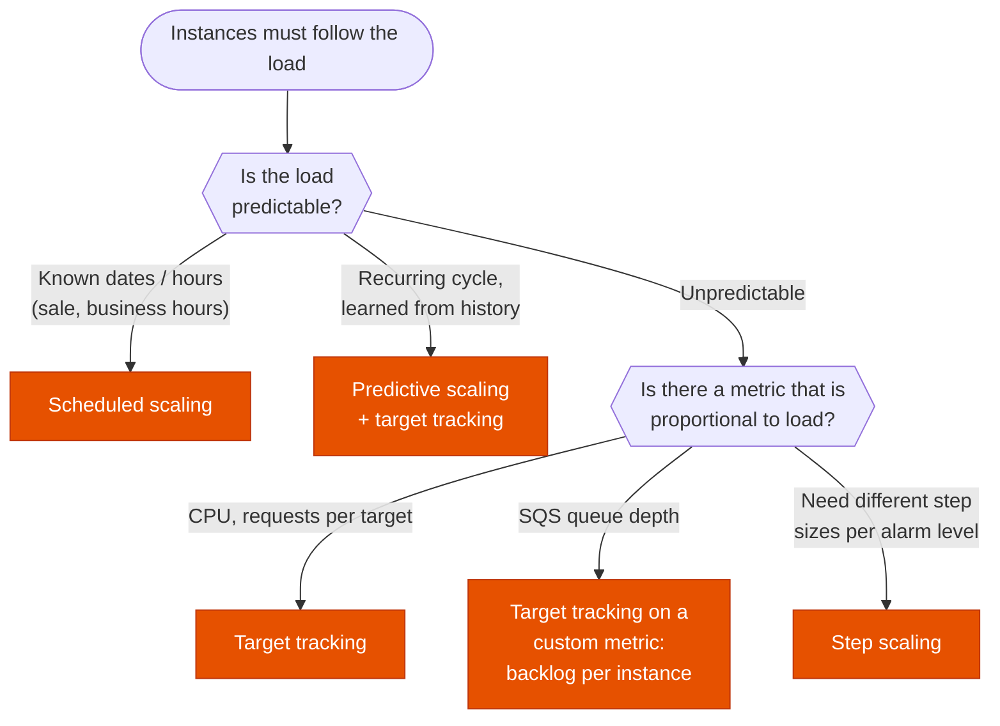

---
tags:
  - "Domain 2: New Solutions"
  - "Domain 3: Continuous Improvement"
  - EC2 Auto Scaling
  - Compute
---

# Auto Scaling groups: which scaling policy?

**The question:** an Auto Scaling group must follow the load. Which policy adds and removes instances at the right time: target tracking, step, simple, scheduled or predictive? And what do you add when instances need time before or after serving traffic?

**Trigger keywords:** *"keep CPU at 50%"*, *"requests per target"*, *"SQS queue backlog"*, *"every Monday at 8 AM"*, *"recurring daily pattern"*, *"scale before the load arrives"*, *"long boot time"*, *"run a script before the instance is terminated"*, *"least operational overhead"*.

## Fundamentals

An ASG keeps the number of **InService** instances between **min** and **max**, at the **desired capacity**. Policies only change the desired capacity.

| Policy | How it decides | Use it when |
|---|---|---|
| **Target tracking** | Keeps one metric at a target value. Creates and manages its CloudWatch alarms itself. | Default choice: a metric that grows with load (CPU, `ALBRequestCountPerTarget`, network, backlog per instance) |
| **Step scaling** | Your CloudWatch alarm; **bigger breach → bigger step**. Keeps reacting during a scaling activity. | Need fine control on how much to add per alarm level |
| **Simple scaling** | Your alarm; one adjustment, then waits for the **cooldown** (default 300 s) | Legacy. Prefer step or target tracking. |
| **Scheduled** | Sets min / max / desired at a date or cron (with time zone) | Known, calendar-based events |
| **Predictive** | ML forecast from **up to 14 days** of history (needs 24 h), plans capacity for the next **48 h**, launches **ahead** of the load | Recurring daily / weekly cycles, slow-booting apps |

- **Combine them.** Several policies can be active: on scale-out the ASG takes the **largest** capacity asked, on scale-in target tracking only scales in when **every** target tracking policy agrees.
- **Predictive + dynamic** is the usual pair: predictive sets a floor ahead of the curve, target tracking handles the unexpected.
- **Predictive in *forecast only* mode** first, to check the forecast before it acts.
- **Instance warmup** (target tracking, step): a new instance's metrics are ignored until it's warmed up, so the ASG doesn't over-scale. Set a **default instance warmup** on the group.
- **Cooldown** only applies to **simple** scaling.

## Decision tree

## Why each branch

- **Known dates → scheduled.** No metric needed: raise the min before the event, lower it after. Waiting for CPU to rise means users see the slow part.
- **Recurring cycle → predictive.** It learns the pattern and launches instances **before** the peak, which matters when boot time is long. Keep a target tracking policy for what the forecast misses.
- **Unpredictable → target tracking.** You give a target, AWS builds and tunes the alarms. It's the *"least operational overhead"* answer.
- **SQS workers → backlog per instance.** Queue depth alone doesn't scale with the fleet: 1,000 messages is a lot for 2 instances, nothing for 100. Publish `ApproximateNumberOfMessagesVisible / InService instances` as a custom metric, target = acceptable latency / processing time per message.
- **Step scaling** when you want explicit rules: *"+1 above 60% CPU, +3 above 80%"*. More work, more control.

## Around the policies

| Feature | What it solves |
|---|---|
| **Lifecycle hooks** | Pause an instance in `Pending:Wait` (install, register, warm a cache) or `Terminating:Wait` (drain, copy logs). Default timeout 1 h, max 48 h. Notify via **EventBridge**, SNS or SQS; finish with `CompleteLifecycleAction` (`CONTINUE` / `ABANDON`). |
| **Warm pool** | Pre-initialized instances kept **Stopped**, **Hibernated** or Running. Scale-out takes seconds instead of a long boot. You pay EBS (and EC2 if Running). |
| **Health checks** | EC2 status checks by default. Turn on **ELB health checks** so an instance failing the app check is replaced. **Grace period** gives new instances time before checks count. |
| **Instance refresh** | Rolling replacement after a new AMI / launch template. **Min healthy %**, checkpoints, auto rollback. |
| **Termination policy** | Default: first balance AZs, then the oldest launch template, then closest to the next billing hour. **Scale-in protection** keeps specific instances. |
| **Standby / suspend processes** | Take an instance out to troubleshoot (`Standby`), or suspend `ReplaceUnhealthy`, `AZRebalance`, `Launch`… during maintenance. |

## Exam traps

!!! warning "Scaling on queue length"
    Target tracking on `ApproximateNumberOfMessagesVisible` alone over- or under-scales. The answer uses **backlog per instance**.

!!! warning "Editing the target tracking alarms"
    The alarms created by target tracking are managed by Auto Scaling. Don't edit or delete them: change the policy instead.

!!! warning "Predictive for a one-off event"
    Predictive needs a **recurring** pattern in history. A one-time launch or Black Friday sale is **scheduled** scaling.

!!! warning "Cooldown vs warmup"
    *"Instances keep being added before the new ones take load"*: set the **instance warmup**, not the cooldown. Cooldown only affects simple scaling.

!!! warning "Slow boot fixed with a bigger policy"
    If boot takes 10 minutes, a faster alarm won't help. Answers: **warm pool**, **predictive scaling**, or a baked **AMI** (Image Builder) instead of user data installs.

!!! warning "Instances healthy but app down"
    Default health check is EC2 only. Behind a load balancer, enable the **ELB health check type**, or broken instances are never replaced.

## Test yourself

??? question "1. A web tier behind an ALB has unpredictable traffic. Keep each instance at a steady load with least operational overhead?"
    **Target tracking** on `ALBRequestCountPerTarget` (or average CPU).

??? question "2. Traffic peaks every weekday at 9 AM. The app takes 8 minutes to boot and users see errors each morning. What do you add?"
    **Predictive scaling** (launches ahead of the cycle), kept alongside target tracking. A **warm pool** also cuts the boot time. Scheduled scaling works too, but predictive needs no manual upkeep.

??? question "3. Workers poll an SQS queue. Processing a message takes 2 s and the business accepts 60 s of latency. How do you scale?"
    Target tracking on a custom metric **backlog per instance**, target = 60 / 2 = **30 messages per instance**.

??? question "4. Instances must deregister from a license server and upload logs before they terminate. How?"
    A **lifecycle hook** on termination (`Terminating:Wait`) → EventBridge → Lambda or SSM Run Command, then `CompleteLifecycleAction`.

??? question "5. A marketing campaign starts on 1 Dec at 10:00 and lasts one week. Capacity must be ready before it starts."
    **Scheduled scaling**: two scheduled actions, one raising min / desired on 1 Dec before 10:00, one lowering it after.

## Related

- [Cross-zone load balancing](../networking/elb-cross-zone.md)
- [RDS auto scaling: what scales by itself?](../databases/rds-auto-scaling.md)
- AWS docs: [Scaling policies for EC2 Auto Scaling](https://docs.aws.amazon.com/autoscaling/ec2/userguide/as-scale-based-on-demand.html)
- AWS docs: [Scaling based on Amazon SQS](https://docs.aws.amazon.com/autoscaling/ec2/userguide/as-using-sqs-queue.html)
- AWS docs: [Predictive scaling](https://docs.aws.amazon.com/autoscaling/ec2/userguide/ec2-auto-scaling-predictive-scaling.html)
