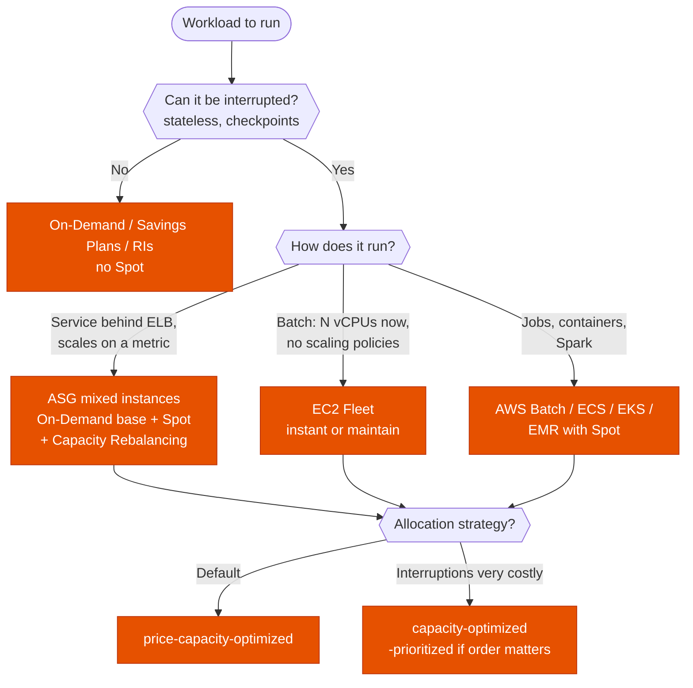

---
tags:
  - "Domain 2: New Solutions"
  - "Domain 3: Continuous Improvement"
  - EC2
  - Spot
  - Compute
---

# Spot fleets: which tool and which allocation strategy?

**The question:** a workload can run on Spot to cut cost. Do you launch it with an Auto Scaling group, EC2 Fleet or Spot Fleet? And which allocation strategy keeps interruptions low?

**Trigger keywords:** *"fault-tolerant"*, *"stateless"*, *"can be interrupted"*, *"batch / big data / CI"*, *"up to 90% cheaper"*, *"minimize interruptions"*, *"lowest cost"*, *"mix of On-Demand and Spot"*, *"diversify instance types"*, *"2-minute warning"*.

## Fundamentals

- **Spot pool** = one instance type in one AZ. Each pool has its own price and spare capacity. **More pools = fewer interruptions.**
- **Interruption:** AWS gives a **2-minute notice** (instance metadata + EventBridge). Earlier, a **rebalance recommendation** may warn that the instance is at elevated risk.
- **Interruption behavior:** terminate (default), **stop** or **hibernate** (EBS-backed, persistent request).
- **Max price:** defaults to the On-Demand price. Don't set it lower: you just get interrupted more.
- **Spot blocks** (defined duration) are gone. A distractor.

| Tool | What it is | Use it when |
|---|---|---|
| **ASG, mixed instances policy** | On-Demand **base** + % On-Demand above base, rest Spot, several instance types. Scaling policies, ELB, health checks. | Default for services behind a load balancer, anything that scales on a metric |
| **EC2 Fleet** | One API call for a target capacity across types, AZs, Spot + On-Demand. Types: **instant** (one shot, synchronous), **request**, **maintain**. | Batch / HPC: *"launch 500 vCPUs now"*, no scaling policies needed |
| **Spot Fleet** | Older API, same idea: **request** (one-time) or **maintain** | Legacy. AWS recommends ASG or EC2 Fleet for new work. |
| **Managed** (AWS Batch, ECS / EKS capacity providers, EMR instance fleets) | Spot handled by the service | The workload already runs on that service |

**Target capacity** can be in instances, **weighted units** (e.g. `m5.2xlarge` = 2 units) or **vCPU / memory** with **attribute-based instance selection** (no list of types to maintain).

## Allocation strategies (Spot)

| Strategy | Picks pools by | When |
|---|---|---|
| **price-capacity-optimized** | Most spare capacity, then lowest price | ✅ **Default answer** for most workloads |
| **capacity-optimized** | Most spare capacity only | Interruptions are very costly (long jobs, slow checkpoint) |
| **capacity-optimized-prioritized** | Capacity, honoring **your instance type priority** | Same, with a preferred order (e.g. newer generation first) |
| **lowest-price** | Cheapest pools (`InstancePoolsToUseCount`) | Short jobs, cost above all. Highest interruption risk. |
| **diversified** | Spread evenly across all pools | Spot Fleet only, long-running fleets |

On-Demand part: **lowest-price** or **prioritized** (your order, e.g. to use **Reserved Instances / Savings Plans** first).

## Decision tree

## Why each branch

- **Not interruptible → no Spot.** Databases, stateful single instances, anything with a strict SLA on one host. Cut cost with Savings Plans instead.
- **Service → ASG mixed instances.** The On-Demand **base capacity** guarantees a floor that never disappears; Spot adds the rest. **Capacity Rebalancing** launches a replacement when a rebalance recommendation arrives, before the 2-minute notice.
- **Batch → EC2 Fleet.** One call, many types and AZs, Spot + On-Demand in the same request. `instant` returns the instances it could launch, synchronously.
- **Managed services** already do the fleet work: pick them when the workload fits.
- **Diversify.** At least several instance types (same size class or with weights) across **all AZs**. A single pool is the most common cause of *"Spot capacity not available"*.

## Exam traps

!!! warning "lowest-price to save money"
    It concentrates on the cheapest pools, which are the first to be reclaimed. The *"cost-effective and fewest interruptions"* answer is **price-capacity-optimized**.

!!! warning "Canceling the request"
    Canceling a Spot request (or a Spot Fleet without the terminate option) does **not** terminate running instances. Cancel the request **and** terminate the instances, or a persistent request relaunches them.

!!! warning "Spot for the whole tier"
    *"Must always serve traffic"* + Spot: keep an **On-Demand base** in the ASG. 100% Spot can lose all capacity at once.

!!! warning "Spot blocks / fixed duration"
    No longer offered. For *"guaranteed capacity for 6 hours"*, look at **On-Demand Capacity Reservations** or **Capacity Blocks for ML**.

!!! warning "Handling the 2-minute notice"
    Catch the **EC2 Spot Instance Interruption Warning** in **EventBridge** (or poll instance metadata) to drain, checkpoint, deregister. Not CloudWatch metrics.

## Test yourself

??? question "1. A stateless web tier behind an ALB must stay up but cost as little as possible. How do you use Spot?"
    **ASG with a mixed instances policy**: On-Demand base (e.g. 2 instances), Spot above it across several instance types and AZs, **price-capacity-optimized**, **Capacity Rebalancing** on.

??? question "2. A rendering job needs 2,000 vCPUs for the next hour, on any compatible instance type, as cheaply as possible."
    **EC2 Fleet** (`instant` or `request`) with **attribute-based instance selection** on vCPU / memory, Spot, **price-capacity-optimized**.

??? question "3. Long simulation jobs checkpoint every 2 hours and are often interrupted. Which allocation strategy?"
    **capacity-optimized**: pick the deepest pools to minimize interruptions. Also checkpoint on the 2-minute notice through EventBridge.

??? question "4. A team canceled its Spot Fleet request but the bill still shows Spot instances. Why?"
    The instances keep running unless the cancel uses **terminate instances**. Terminate them explicitly.

??? question "5. A company has Reserved Instances for m5.large and wants an ASG to use them first for its On-Demand part, the rest on Spot."
    Mixed instances policy with the On-Demand allocation strategy **prioritized**, `m5.large` first in the list.

## Related

- [Auto Scaling groups: which scaling policy?](asg-scaling-policies.md)
- AWS docs: [Allocation strategies for Spot Instances](https://docs.aws.amazon.com/AWSEC2/latest/UserGuide/ec2-fleet-allocation-strategy.html)
- AWS docs: [Auto Scaling groups with multiple instance types and purchase options](https://docs.aws.amazon.com/autoscaling/ec2/userguide/ec2-auto-scaling-mixed-instances-groups.html)
- AWS docs: [Spot Instance interruptions](https://docs.aws.amazon.com/AWSEC2/latest/UserGuide/spot-interruptions.html)
