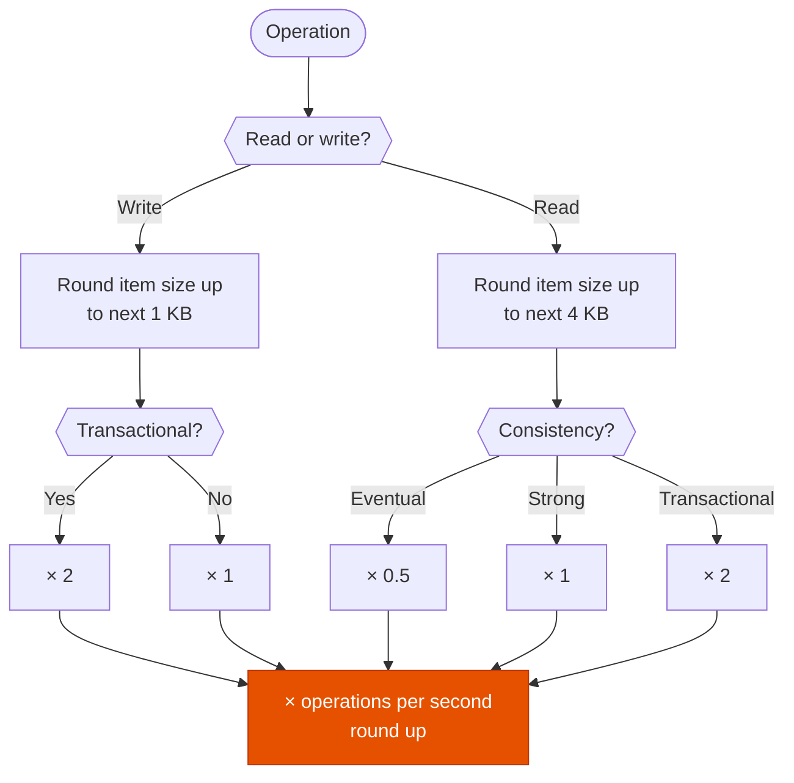

---
tags:
  - "Domain 2: New Solutions"
  - "Domain 3: Continuous Improvement"
  - DynamoDB
  - Databases
---

# DynamoDB: how many RCU and WCU?

**The question:** a table must handle N reads or writes per second of items of size S. How many read capacity units (RCU) and write capacity units (WCU) do you provision?

**Trigger keywords:** *"items of 3.5 KB"*, *"strongly consistent reads per second"*, *"eventually consistent"*, *"transactional writes"*, *"how many WCU"*, *"ProvisionedThroughputExceededException"*, *"hot partition"*.

## Fundamentals

| Operation | 1 unit covers | Size rounded up to | Multiplier |
|---|---|---|---|
| **Write** (standard) | 1 write/s | next **1 KB** | ×1 |
| **Write** (transactional) | | next **1 KB** | **×2** |
| **Read** strongly consistent | 1 read/s | next **4 KB** | ×1 |
| **Read** eventually consistent | 2 reads/s | next **4 KB** | **×0.5** |
| **Read** transactional | | next **4 KB** | **×2** |

```text
WCU = writes/s × ceil(size / 1 KB) × (1 standard | 2 transactional)
RCU = reads/s  × ceil(size / 4 KB) × (0.5 eventual | 1 strong | 2 transactional)
→ round the final result up
```

- **Per minute?** Divide by 60 first: the units are **per second**.
- **On-demand** uses the same sizes, billed as **read/write request units** (RRU/WRU) instead of provisioned units.
- **Partition limits:** 3,000 RCU and 1,000 WCU per partition. A table can have enough capacity overall and still throttle on a **hot key**.
- **Burst capacity:** unused capacity from the last 300 s can absorb short spikes. Not something to size on.

## Calculation flow



## Worked examples

### Writes

| Case | Calculation | WCU |
|---|---|---|
| 10 writes/s, 1 KB | 10 × 1 | **10** |
| 10 writes/s, 2.5 KB | 10 × ceil(2.5) = 10 × 3 | **30** |
| 10 **transactional** writes/s, 2.5 KB | 10 × 3 × 2 | **60** |
| 120 writes/**minute**, 1.5 KB | 120 / 60 = 2/s → 2 × 2 | **4** |
| 6 writes/s, 0.3 KB | 6 × ceil(0.3) = 6 × 1 | **6** |

### Reads

| Case | Calculation | RCU |
|---|---|---|
| 10 strong reads/s, 4 KB | 10 × 1 | **10** |
| 10 strong reads/s, 6 KB | 10 × ceil(6/4) = 10 × 2 | **20** |
| 10 **eventual** reads/s, 6 KB | 10 × 2 × 0.5 | **10** |
| 10 **transactional** reads/s, 6 KB | 10 × 2 × 2 | **40** |
| 15 eventual reads/s, 1 KB | 15 × 1 × 0.5 = 7.5 | **8** |
| 5 strong reads/s, 4.1 KB | 5 × ceil(4.1/4) = 5 × 2 | **10** |

### Special cases

| Case | Rule |
|---|---|
| **Query / Scan** | Sizes of all items **read** are **summed**, then rounded up to 4 KB once. 20 items of 0.5 KB = 10 KB → **3 RCU** (strong). |
| **BatchGetItem / BatchWriteItem** | Each item is rounded **individually**. Same 20 items of 0.5 KB → **20 RCU**. |
| **Filter expression** | Applied **after** the read: you pay for every item scanned, not the ones returned. Same for projections. |
| **UpdateItem** | Size = the **larger** of the item before and after the update. |
| **DeleteItem** | Size of the deleted item. |
| **Item not found** (GetItem) | Still **1 RCU** strong (0.5 eventual). |
| **Failed conditional write** | Still consumes the WCU. |
| **GSI** | Each write that touches a GSI's attributes also consumes WCU **on the GSI** (projected size). A throttled GSI throttles the base table writes. GSI reads are always **eventually consistent**. |
| **LSI** | Shares the base table's capacity. Writes consume extra WCU for the index entry. |
| **Global tables** | Each write is replicated: it consumes write capacity **in every replica Region**. |

## Exam traps

!!! warning "Rounding the total instead of each item"
    10 writes/s of 1.5 KB = 10 × **2** = 20 WCU, not 15. Round the **item size** first, then multiply.

!!! warning "Forgetting the ×0.5 or ×2"
    Eventual halves the RCU, transactional doubles both RCU and WCU. Read the consistency in the stem carefully.

!!! warning "Per minute rates"
    *"6,000 reads per minute"* is 100 reads/s. Capacity units are always per second.

!!! warning "Filters to save capacity"
    A `FilterExpression` on a Scan saves network, not RCU. To read less, design a key or a GSI that a **Query** can use.

!!! warning "Throttling with plenty of capacity"
    Total RCU/WCU is fine but one partition key gets most of the traffic: hot partition. Fix the key design (add a suffix, spread writes), or cache reads with **DAX**.

## Test yourself

??? question "1. 25 items of 3 KB written per second. How many WCU?"
    25 × ceil(3) = **75 WCU**.

??? question "2. 25 items of 3 KB read per second, strongly consistent. And eventually consistent?"
    25 × ceil(3/4) = 25 × 1 = **25 RCU** strong, **12.5 → 13 RCU** eventual.

??? question "3. 50 transactional writes/s of 500 bytes?"
    50 × 1 × 2 = **100 WCU**.

??? question "4. 1,800 eventually consistent reads per minute of 9 KB?"
    1,800 / 60 = 30/s → 30 × ceil(9/4) = 30 × 3 = 90 → × 0.5 = **45 RCU**.

??? question "5. A Query returns 8 items of 1.5 KB with strong consistency. And the same 8 items with BatchGetItem?"
    Query: 8 × 1.5 = 12 KB → 12 / 4 = **3 RCU**. BatchGetItem: 8 × ceil(1.5/4) = **8 RCU**.

??? question "6. 40 transactional reads/s of 10 KB?"
    40 × ceil(10/4) × 2 = 40 × 3 × 2 = **240 RCU**.

??? question "7. A table has 2 GSIs that both project all attributes. 10 writes/s of 2 KB. Total WCU consumed?"
    Base table 10 × 2 = 20, plus 20 per GSI → **60 WCU** (each GSI's capacity is provisioned separately).

## Related

- [RDS auto scaling: what scales by itself?](rds-auto-scaling.md)
- AWS docs: [Read/write capacity mode](https://docs.aws.amazon.com/amazondynamodb/latest/developerguide/capacity-mode.html)
- AWS docs: [Item sizes and capacity unit consumption](https://docs.aws.amazon.com/amazondynamodb/latest/developerguide/read-write-operations.html)
