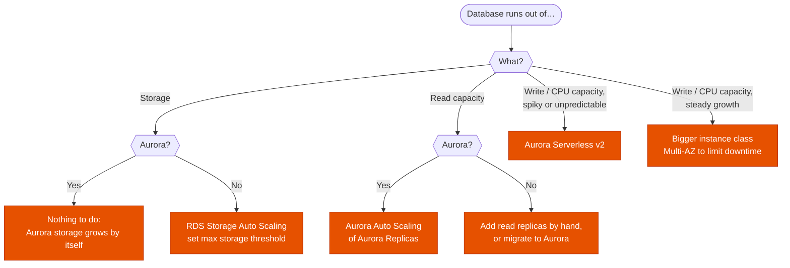

---
tags:
  - "Domain 2: New Solutions"
  - "Domain 3: Continuous Improvement"
  - RDS
  - Aurora
  - Databases
---

# RDS auto scaling: what scales by itself?

**The question:** a database keeps running out of storage, CPU or read capacity. What can AWS scale automatically, and what do you have to change yourself?

**Trigger keywords:** *"storage auto scaling"*, *"unpredictable storage growth"*, *"running out of disk space"*, *"storage-full"*, *"maximum storage threshold"*, *"scale read replicas automatically"*, *"variable workload"*, *"least operational overhead"*.

## Fundamentals

| Resource | RDS (MySQL, MariaDB, PostgreSQL, Oracle, SQL Server) | Aurora |
|---|---|---|
| **Storage** | **Storage Auto Scaling**, opt-in: set a **maximum storage threshold** | Automatic, nothing to enable, up to 128 TiB |
| **Storage decrease** | ❌ never in place | ✅ shrinks when data is deleted |
| **Read capacity** | Read replicas, added by hand | **Aurora Auto Scaling** of replicas (up to 15) |
| **Compute** | Change the instance class by hand | Same, or **Aurora Serverless v2** (scales ACUs) |

**How RDS Storage Auto Scaling decides**

It increases storage when **all three** are true:

1. Free space is **below 10%** of allocated storage.
2. The low-storage condition lasts **at least 5 minutes**.
3. At least **6 hours** have passed since the last storage modification (or the storage optimization finished, whichever is longer).

It adds the **greatest** of: 10 GiB, 10% of current storage, or the growth predicted for the next 7 hours. It never goes above the maximum threshold. No extra charge beyond the storage itself.

- Each **read replica** has its own setting: enable it on the replicas too.
- **Aurora Auto Scaling** uses Application Auto Scaling target tracking on average **CPU** or **connections** of the replicas. Applications use the **reader endpoint** to benefit.

## Decision tree

## Why each branch

- **RDS storage → Storage Auto Scaling.** It's the *"least operational overhead"* answer to *"storage grows unpredictably"*. A CloudWatch alarm on `FreeStorageSpace` + Lambda that calls `ModifyDBInstance` works but is the do-it-yourself version.
- **Aurora storage → nothing.** The cluster volume grows in 10 GiB segments automatically. *"Enable storage auto scaling on Aurora"* is a distractor.
- **Reads on Aurora → Aurora Auto Scaling.** Replicas are added and removed on a CPU or connections target. RDS has no equivalent for its read replicas.
- **Compute → Serverless v2 or scale up.** A provisioned instance class never changes by itself. Serverless v2 is the only option that scales compute automatically, in fine-grained ACUs.

## Exam traps

!!! warning "The 6-hour wait"
    Storage auto scaling won't trigger again within 6 hours of the last modification. A big bulk load right after an increase can still fill the disk: provision enough storage before the load.

!!! warning "Scaling storage down"
    RDS storage can't be reduced in place, with or without auto scaling. You'd need a new instance and a data migration. Set a sensible **maximum threshold** to cap cost.

!!! warning "Forgetting the replicas"
    Auto scaling on the primary doesn't cover read replicas. A replica that runs out of storage stops replicating.

!!! warning "Auto scaling the instance class"
    No RDS feature changes the instance class automatically. *"Automatically adjust compute capacity"* points to **Aurora Serverless v2**.

## Test yourself

??? question "1. An RDS for PostgreSQL database's storage grows unpredictably and filled up twice last quarter. Least operational overhead?"
    Enable **Storage Auto Scaling** with a maximum storage threshold, on the primary and on each read replica.

??? question "2. Same issue, but the database is Aurora PostgreSQL. What do you enable?"
    **Nothing.** Aurora storage grows automatically up to 128 TiB. Look for another cause (e.g. local temporary storage of the instance).

??? question "3. An Aurora MySQL cluster sees read traffic triple every evening. How do you add capacity only when needed?"
    **Aurora Auto Scaling** with a target tracking policy on replica CPU, and the application reading through the **reader endpoint**.

??? question "4. A new application on Aurora has unknown, very spiky write traffic. The team doesn't want to size instances. What do you pick?"
    **Aurora Serverless v2**: compute scales automatically in ACUs between a min and max.

## Related

- [RDS Proxy: when does it fix the problem?](rds-proxy.md)
- AWS docs: [RDS Storage Auto Scaling](https://docs.aws.amazon.com/AmazonRDS/latest/UserGuide/USER_PIOPS.Autoscaling.html)
- AWS docs: [Aurora Auto Scaling with Aurora Replicas](https://docs.aws.amazon.com/AmazonRDS/latest/AuroraUserGuide/Aurora.Integrating.AutoScaling.html)
