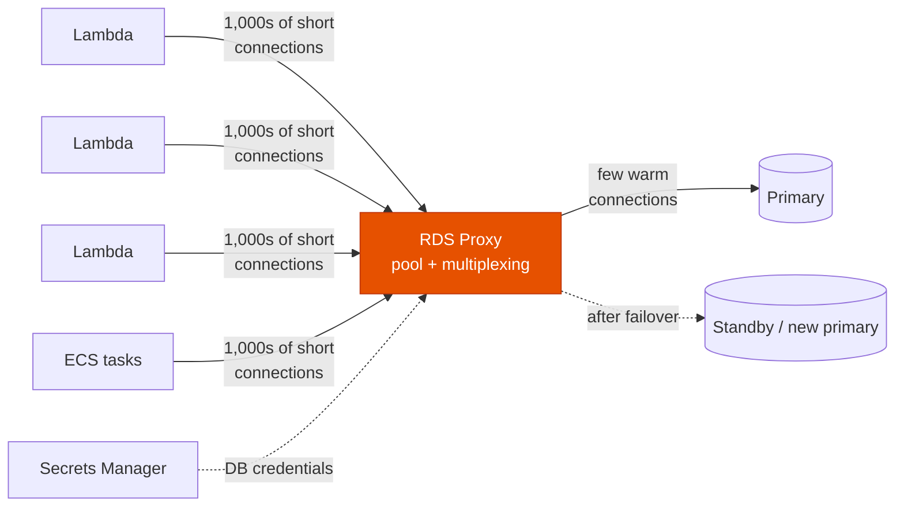
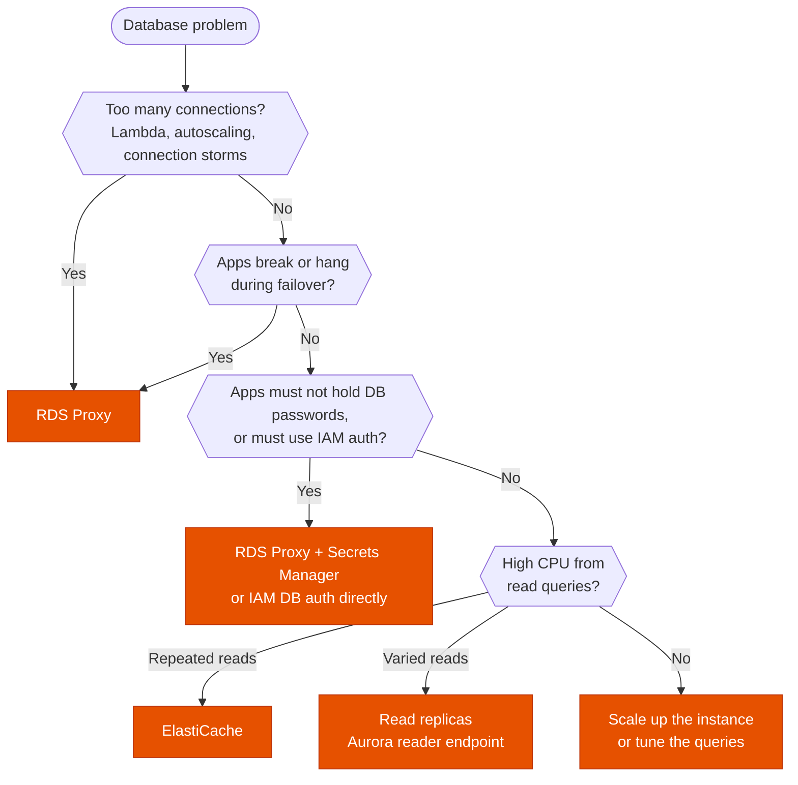

---
tags:
  - "Domain 2: New Solutions"
  - "Domain 3: Continuous Improvement"
  - RDS
  - Aurora
  - Databases
---

# RDS Proxy: when does it fix the problem?

**The question:** a relational database on RDS or Aurora is struggling. Is RDS Proxy the answer, or do you need read replicas, a cache, or a bigger instance?

**Trigger keywords:** *"too many connections"*, *"Lambda functions connecting to RDS"*, *"connection storms"*, *"exhausts database connections"*, *"reduce failover time"*, *"without changing application code"*, *"enforce IAM authentication"*, *"credentials in Secrets Manager"*.

## Fundamentals

RDS Proxy is a **managed, serverless, Multi-AZ** proxy that sits between the application and an RDS or Aurora database (MySQL, MariaDB, PostgreSQL, SQL Server).

| What it does | How |
|---|---|
| **Connection pooling** | Keeps a pool of warm connections to the DB and **multiplexes** many client connections onto them. The DB stops spending CPU and memory opening and closing connections. |
| **Faster failover** | Clients stay connected to the proxy; it reroutes to the new primary without waiting for DNS. AWS quotes **up to 66% less failover time** for Aurora and RDS Multi-AZ. |
| **Security** | Reads the DB credentials from **Secrets Manager**. Clients can be forced to use **IAM authentication** and **TLS**. |
| **No code change** | The application just points at the proxy endpoint instead of the DB endpoint. |

- **VPC only:** never publicly accessible. A Lambda function using it must run in the VPC.
- **Aurora:** a proxy can have a **read-only endpoint** that spreads connections across the Aurora replicas.
- **Pinning:** session state (`SET` variables, temporary tables, some prepared statements) pins a client to one DB connection and reduces multiplexing.
- **Price:** per vCPU of the DB instance per hour (per ACU for Aurora Serverless v2).

**What it doesn't do:** cache query results, add read capacity, or make slow queries faster. Every query still runs on the database.

## Decision tree

## Why each branch

- **Too many connections → RDS Proxy.** Each Lambda invocation opens its own connection, and a burst of invocations exhausts `max_connections`. The proxy absorbs the burst and queues or multiplexes the requests over a small pool. Raising `max_connections` or the instance size treats the symptom and costs more.
- **Failover → RDS Proxy.** Without it, clients see broken connections and wait for the DNS change to the new primary. The proxy keeps client connections open and switches backends itself.
- **Credentials → RDS Proxy or IAM DB auth.** The proxy fetches the password from Secrets Manager, so the application only needs an IAM token for the proxy. If connections aren't the problem, IAM DB authentication directly on the database does the job alone.
- **Read load → not the proxy.** The proxy doesn't add capacity. Repeated identical reads go to **ElastiCache**, varied reads to **read replicas**.

## Comparison

| | RDS Proxy | Read replicas | ElastiCache |
|---|---|---|---|
| Solves | Connection count, failover time | Read throughput | Repeated reads, latency |
| Code change | Endpoint only | Send reads to replica endpoint | Cache logic in the app |
| Extra capacity | ❌ | ✅ | ✅ |
| Faster failover | ✅ | Can be promoted | ❌ |

## Exam traps

!!! warning "Raising max_connections or scaling up"
    *"Lambda functions cause too many connections errors"*: the answer is **RDS Proxy**. A larger instance raises the limit but costs more and fails again at the next spike.

!!! warning "RDS Proxy for read-heavy workloads"
    The proxy doesn't run queries for you. If the stem says *"CPU is high from read queries"*, it's read replicas or ElastiCache.

!!! warning "Reaching the proxy from outside the VPC"
    RDS Proxy can't be public. A Lambda function not attached to the VPC, or a client on the internet, can't reach it.

!!! warning "Credentials stored in the proxy"
    The proxy doesn't store passwords. They live in **Secrets Manager**, and rotating them there needs no change on the proxy side. See [Secrets Manager vs Parameter Store](../security/secrets-storage.md).

## Test yourself

??? question "1. A serverless API on Lambda writes to Aurora MySQL. During traffic spikes the database rejects connections. Least operational overhead?"
    **RDS Proxy** in front of Aurora, Lambda in the VPC connecting to the proxy endpoint.

??? question "2. An RDS for PostgreSQL Multi-AZ failover takes the application down for longer than the failover itself, because connections hang on the old endpoint. What helps without code changes?"
    **RDS Proxy**: clients keep their connection to the proxy, which reroutes to the new primary without DNS propagation.

??? question "3. A reporting dashboard runs the same heavy queries every minute and the primary's CPU is at 90%. RDS Proxy?"
    No. **ElastiCache** for the repeated results (or a read replica for the reports). The proxy doesn't reduce query load.

??? question "4. Security wants no database password in the application code or config, and access controlled through IAM. The app runs on Lambda with many concurrent invocations. What do you use?"
    **RDS Proxy** with **IAM authentication required**, DB credentials in **Secrets Manager**. Lambda's role gets `rds-db:connect` on the proxy.

## Related

- [Secrets Manager vs Parameter Store](../security/secrets-storage.md)
- AWS docs: [Amazon RDS Proxy](https://docs.aws.amazon.com/AmazonRDS/latest/UserGuide/rds-proxy.html)
- AWS docs: [Avoiding pinning](https://docs.aws.amazon.com/AmazonRDS/latest/UserGuide/rds-proxy-pinning.html)
