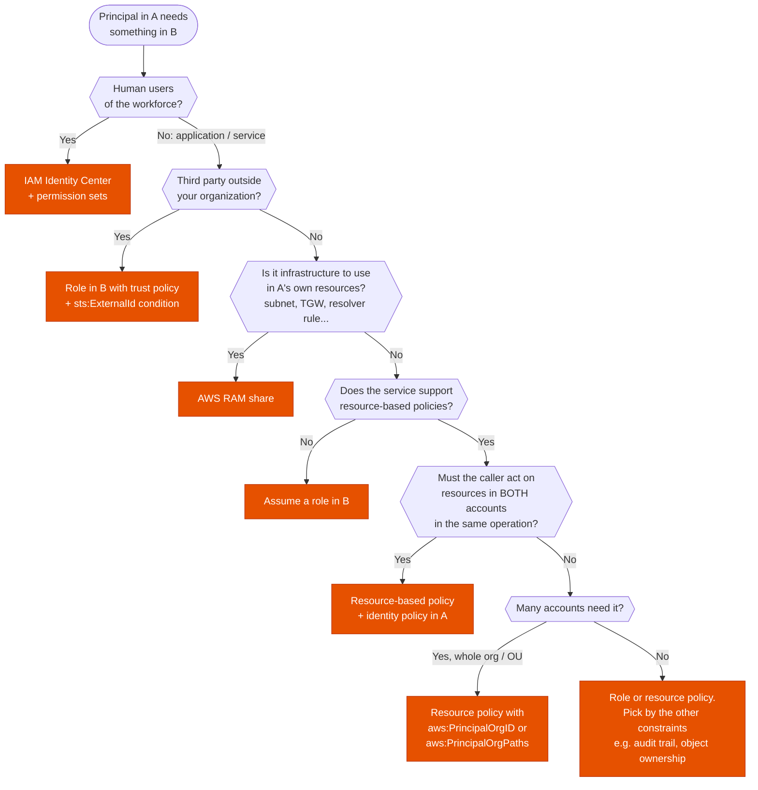

---
tags:
  - "Domain 1: Organizational Complexity"
  - IAM
  - Multi-account
---

# Cross-account access

**The question:** a principal in account A needs to use something in account B. Which mechanism: assume a role, a resource-based policy, a RAM share, or IAM Identity Center?

**Trigger keywords:** *"another account"*, *"third-party vendor / SaaS / auditor"*, *"all accounts in the organization"*, *"central security / logging / shared services account"*, *"without long-term credentials"*, *"confused deputy"*.

## Fundamentals

| Mechanism | How it works | Caller keeps its own permissions? |
|---|---|---|
| **Assume an IAM role** | B has a role whose **trust policy** allows A. A's principal calls `sts:AssumeRole` and gets temporary credentials **in B** | ❌ No. While in the role, it only has the role's permissions |
| **Resource-based policy** | The resource in B (bucket, KMS key, queue, topic, Lambda, secret, ECR repo…) names A as a principal. A calls it with its own credentials | ✅ Yes. Useful when one process touches resources in both accounts |
| **AWS RAM share** | B shares the resource (subnets, Transit Gateway, Resolver rules, prefix lists, License Manager configs, some DB clusters…). It appears in A | n/a. Used for *infrastructure* that A consumes |
| **IAM Identity Center** | Workforce users sign in once and pick an account + permission set. Roles are provisioned in each account for you | n/a. For **humans**, not workloads |

**External ID:** a secret-ish value the third party must pass when assuming the role, set as a condition in the trust policy. It prevents the **confused deputy** problem, where a vendor serving many customers is tricked into using *your* role on behalf of someone else.

## Decision tree

## Why each branch

- **Humans → Identity Center.** One place to manage who can access which account, with temporary credentials only. IAM users per account don't scale and create long-term keys.
- **Third parties → role + External ID.** Never share access keys. The External ID condition is the textbook answer whenever a vendor assumes roles in many customers' accounts.
- **Infrastructure → RAM.** You don't "access" a subnet or a Transit Gateway, you *use* it. RAM makes it appear in the other account with the owner keeping control.
- **Both accounts in one operation → resource policy.** Example: copying objects from a bucket in A to a bucket in B. If the process assumed a role in B, it would lose its access to A's bucket. A resource policy lets it keep its own identity.
- **Whole org → `aws:PrincipalOrgID`.** One condition instead of listing account IDs, and new accounts are covered automatically.
- **Services without resource policies** (most of EC2, RDS APIs, etc.) → a role is the only way.

## Comparison

| | Assume role | Resource-based policy | RAM | Identity Center |
|---|---|---|---|---|
| Works for any service | ✅ | ❌ supported services only | ❌ shareable types only | ✅ (via roles) |
| Caller keeps own permissions | ❌ | ✅ | n/a | n/a |
| Who is logged in CloudTrail in B | The role session | The caller from A | n/a | The role session (with the user name) |
| Credentials | Temporary (STS) | Caller's own | n/a | Temporary |
| Typical exam use | Third parties, automation, "switch role" | S3/KMS/SQS/SNS/Lambda sharing, org-wide access | Shared VPC, TGW, Resolver rules | Workforce SSO |

## Exam traps

!!! warning "KMS: AWS managed keys can't be shared cross-account"
    You can't edit the key policy of an AWS managed key (`aws/s3`, `aws/ebs`…). To let another account decrypt, re-encrypt with a **customer managed key** and grant access in **both** its key policy and the caller's IAM policy. This is a very common exam scenario (e.g. sharing encrypted snapshots or AMIs).

!!! warning "S3 object ownership"
    With ACLs enabled, objects uploaded by account A into B's bucket were owned by A, and B could not read them. With **Bucket owner enforced** (ACLs disabled, the default for new buckets), the bucket owner owns everything. If a scenario says *"the bucket owner can't access uploaded objects"*, think object ownership.

!!! warning "Role chaining caps the session at 1 hour"
    Assuming a role from a role session limits the session to 1 hour, whatever the role's max session duration.

!!! warning "Trust policy alone isn't enough"
    B's role trusts A, but A's principal also needs `sts:AssumeRole` on that role ARN in its own identity policy. This is the cross-account "both sides must allow" rule again.

## Test yourself

??? question "1. A SaaS monitoring vendor needs read-only access to CloudWatch metrics in 40 customer accounts. What do you set up in each account?"
    An IAM role with read-only CloudWatch permissions whose **trust policy** allows the vendor's account **with a condition on `sts:ExternalId`** (the unique value the vendor gives you). No access keys.

??? question "2. A nightly job in account A copies objects from A's bucket to a bucket in account B. Which mechanism?"
    **Resource-based bucket policy on B's bucket** granting A's job role `s3:PutObject`, plus an identity policy in A. The job keeps access to both buckets under one identity. With Bucket owner enforced on B's bucket, B owns the copies.

??? question "3. All 120 accounts in the org must be able to write logs to a central bucket, including accounts created next month. Cheapest to maintain?"
    Bucket policy allowing writes with the condition **`aws:PrincipalOrgID` = the org's ID**. New accounts are covered automatically.

??? question "4. A shared-services account owns a Transit Gateway that 30 workload accounts must attach their VPCs to. How?"
    **Share the TGW with AWS RAM** to the org or OU, then each account creates its VPC attachment.

??? question "5. Account A shares an encrypted EBS snapshot with account B, but B can't create a volume from it. The snapshot is encrypted with the default `aws/ebs` key. Fix?"
    AWS managed keys can't be shared. **Copy the snapshot re-encrypted with a customer managed key**, grant B `kms:Decrypt`/`kms:CreateGrant` etc. in that key's policy, share the new snapshot, and give B's principals matching IAM permissions.

## Related

- [Will this request be allowed?](policy-evaluation.md)
- AWS docs: [The confused deputy problem](https://docs.aws.amazon.com/IAM/latest/UserGuide/confused-deputy.html)
