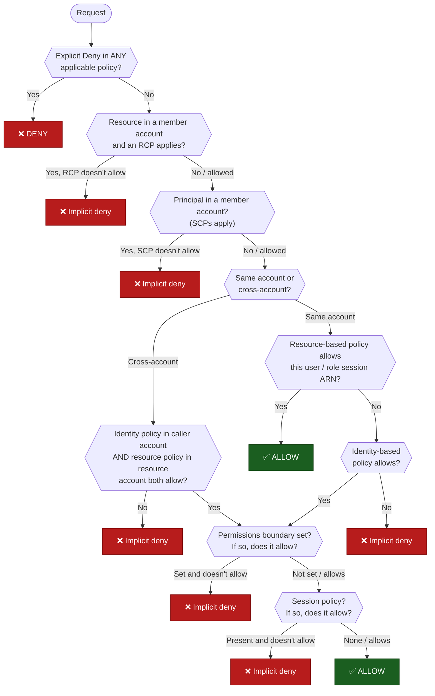

---
tags:
  - "Domain 1: Organizational Complexity"
  - IAM
  - AWS Organizations
---

# Will this request be allowed?

**The question:** a principal calls an AWS API on a resource. Given all the policies involved, is the request allowed or denied, and *which* policy decides?

**Trigger keywords:** *"even administrators must not be able to…"*, *"developers can still…"*, *"the request fails with AccessDenied although the IAM policy allows it"*, *"delegate permission management"*, *"member account"*, *"management account"*, *"cross-account"*.

## Fundamentals

Seven policy types can take part in one evaluation:

| Policy type | Attached to | Grants? | Role |
|---|---|---|---|
| **Identity-based policy** | IAM user, group, role | ✅ | The normal way to grant permissions |
| **Resource-based policy** | The resource (S3 bucket, KMS key, SQS queue, role trust policy…) | ✅ | Grants to principals, including principals in *other* accounts |
| **Permissions boundary** | IAM user or role | ❌ caps only | Maximum permissions an identity policy can give that identity |
| **Session policy** | Passed at `AssumeRole` / federation time | ❌ caps only | Narrows one session |
| **SCP** (service control policy) | Org root, OU, account | ❌ caps only | Maximum permissions for **principals** in member accounts |
| **RCP** (resource control policy) | Org root, OU, account | ❌ caps only | Maximum permissions on **resources** in member accounts (a subset of services, e.g. S3, STS, KMS, SQS, Secrets Manager) |
| **VPC endpoint policy** | VPC endpoint | ❌ caps only | Filters requests that travel through that endpoint |

**Core rules:**

- **Default is deny** (implicit deny).
- **An explicit `Deny` anywhere wins**, always.
- **Guardrails never grant.** SCPs, RCPs, permissions boundaries, session policies and endpoint policies can only *remove* permissions. Something else must still grant.

## Decision tree



## Why each branch

- **Explicit deny first.** A deny is the only statement no allow can override. That's why guardrails like *"nobody may disable CloudTrail"* are written as `Deny` statements in SCPs.
- **RCPs and SCPs come before any grant.** They define the outer limit of what's possible in a member account. The account's own admins can't change them, which is exactly why they're the answer to *"even account administrators must not be able to…"*.
- **SCPs don't apply to the management account**, and they don't restrict **service-linked roles**. They **do** apply to the **root user of member accounts**.
- **Same account, resource policy naming a user or role session:** the resource policy alone is enough to allow, with no identity policy needed. If the resource policy names a **role ARN** (not a session), an implicit deny in a permissions boundary or session policy still limits it.
- **Cross-account needs both sides.** The resource owner's policy says *"I trust account A"*, and account A must still grant the permission to its own principal with an identity policy. Trusting another account delegates the decision to that account's admins. It doesn't give their users access by itself.
- **Boundaries and session policies intersect.** Effective permissions = identity policy ∩ boundary ∩ session policy (∩ SCP ∩ RCP).

## Comparison: which guardrail?

| Need | Use | Why not the others |
|---|---|---|
| Nobody in these **accounts** can do X, admins and root included | **SCP** | Account admins can edit IAM policies and boundaries |
| Nobody, **even from outside the org**, can access these **resources** except under condition Y (e.g. only org principals) | **RCP** | SCPs only restrict your own principals, not external ones |
| Let a team create roles, but never with more than Z | **Permissions boundary** (+ an IAM condition forcing it on created roles) | An SCP would cap the whole account, not just the delegated admin |
| Narrow one temporary session | **Session policy** | Per-session, no change to the role |
| Requests through this endpoint may only reach our buckets | **VPC endpoint policy** | Scoped to the network path |

## SCP strategies: deny list vs allow list

| | **Deny list** (default) | **Allow list** |
|---|---|---|
| Idea | Everything is allowed except what you explicitly deny | Nothing is allowed except what you explicitly allow |
| Implementation | Keep the AWS-managed `FullAWSAccess` SCP attached everywhere, then attach SCPs with `Deny` statements to the OUs or accounts | **Detach** `FullAWSAccess` and attach an SCP with `Allow` statements listing the approved services. The allow must exist at **every level** (root → each OU → account), because the effective permissions are the intersection of all levels |
| Advantages | New AWS services work immediately. Low maintenance. Precise guardrails with `Condition` (e.g. `aws:RequestedRegion`) and exemptions (e.g. `aws:PrincipalArn` for a break-glass role) | Tightest control: only approved services can ever be used. Good fit for regulated or sandbox OUs |
| Drawbacks | A new service is usable until someone thinks to deny it | Every new service needs an SCP update. A missing allow at one level silently blocks the whole subtree. More maintenance, and the SCP size limit (5,120 chars, max 5 SCPs per target) fills up quickly |
| Stem keywords | *prevent X*, *deny region Y*, *nobody may disable CloudTrail* | *only approved services*, *explicitly allowed services only* |

```json title="Deny list: block every Region except eu-west-1 (global services exempted)"
{
  "Effect": "Deny",
  "NotAction": ["iam:*", "organizations:*", "sts:*", "cloudfront:*", "route53:*", "support:*"],
  "Resource": "*",
  "Condition": { "StringNotEquals": { "aws:RequestedRegion": "eu-west-1" } }
}
```

```json title="Allow list: replaces FullAWSAccess on the OU"
{
  "Effect": "Allow",
  "Action": ["ec2:*", "s3:*", "rds:*", "cloudwatch:*"],
  "Resource": "*"
}
```

!!! tip "What to remember for the exam"
    - **Deny list:** keep `FullAWSAccess` attached and add `Deny` statements. New AWS services work immediately, and you can add precise conditions and exemptions (for example, a break-glass role).
    - **Allow list:** detach `FullAWSAccess` and list only the approved services. The allow has to exist at every level from the root down to the account. It gives the tightest control, but each new service needs an SCP update, and a missing allow at one level blocks everything below it.

In practice, most organizations use a **deny list** as the base and switch to an allow list only on specific OUs. Test either one on a sandbox OU before attaching it higher up.

## Exam traps

!!! warning "SCPs never grant"
    A distractor like *"attach an SCP that allows s3:\* to the account"* doesn't give anyone permissions. An IAM policy still has to grant them.

!!! warning "Allow-list SCPs and conditions"
    Until September 2025, `Allow` statements in SCPs could only use `"Resource": "*"` and no `Condition`; only `Deny` statements could be conditional. AWS has since lifted this, but exam questions may still assume the old rule: if a guardrail needs a condition (Region, tag, principal exemption), the expected answer is a **`Deny` with a condition**.

!!! warning "Management account is immune to SCPs"
    Moving a sensitive workload into the management account to "protect it with SCPs" does the opposite. Keep workloads **out** of the management account.

!!! warning "Cross-account: trusting the account ≠ granting the user"
    A bucket policy with `"Principal": {"AWS": "arn:aws:iam::111122223333:root"}` trusts the account. Users in it still need an identity policy allowing the action.

!!! warning "Explicit deny in an SCP beats an explicit allow in a bucket policy"
    Order of statements and "more specific" policies don't matter. A deny wins.

## Test yourself

??? question "1. An admin in a member account has `AdministratorAccess`. An SCP on the OU denies all actions outside `eu-west-1` (global services exempted). They launch an EC2 instance in `us-east-1`. What happens? What if the same admin role exists in the management account?"
    **Member account: denied.** The explicit deny in the SCP wins over `AdministratorAccess`.
    **Management account: allowed.** SCPs don't apply to the management account.

??? question "2. Same account: a bucket policy allows IAM user `bob` `s3:GetObject`. Bob has no identity policies at all. Can he read objects?"
    **Yes.** In the same account, a resource-based policy that names the user ARN is enough by itself.

??? question "3. A bucket in account B allows `arn:aws:iam::A:root` to `s3:GetObject`. User `alice` in account A has no IAM policy. Can she read?"
    **No.** Cross-account access requires **both** the resource policy (B trusts A) **and** an identity policy in A granting `s3:GetObject` on that bucket to Alice.

??? question "4. A role's identity policy allows `s3:*` and `ec2:*`. Its permissions boundary allows only `s3:*`. It calls `ec2:DescribeInstances`. Result?"
    **Denied.** Effective permissions are the intersection, which is only `s3:*`.

??? question "5. A company must guarantee that its S3 buckets can never be accessed by principals outside the organization, even if someone later writes a permissive bucket policy. Which control?"
    **An RCP** denying S3 access when `aws:PrincipalOrgID` is not the org's ID (with exceptions for AWS service principals where needed). SCPs can't do this, because they only restrict the org's *own* principals.

??? question "6. A delegated team admin must create IAM roles for their Lambda functions, but must never be able to create a role more powerful than a given set. What's the pattern?"
    Allow `iam:CreateRole` / `iam:PutRolePolicy` **only with the condition** `iam:PermissionsBoundary` = the approved boundary ARN, and deny removing or changing the boundary. Every role they create is capped by the boundary.

## Related

- [Cross-account access](cross-account-access.md)
- AWS docs: [Policy evaluation logic](https://docs.aws.amazon.com/IAM/latest/UserGuide/reference_policies_evaluation-logic.html)
