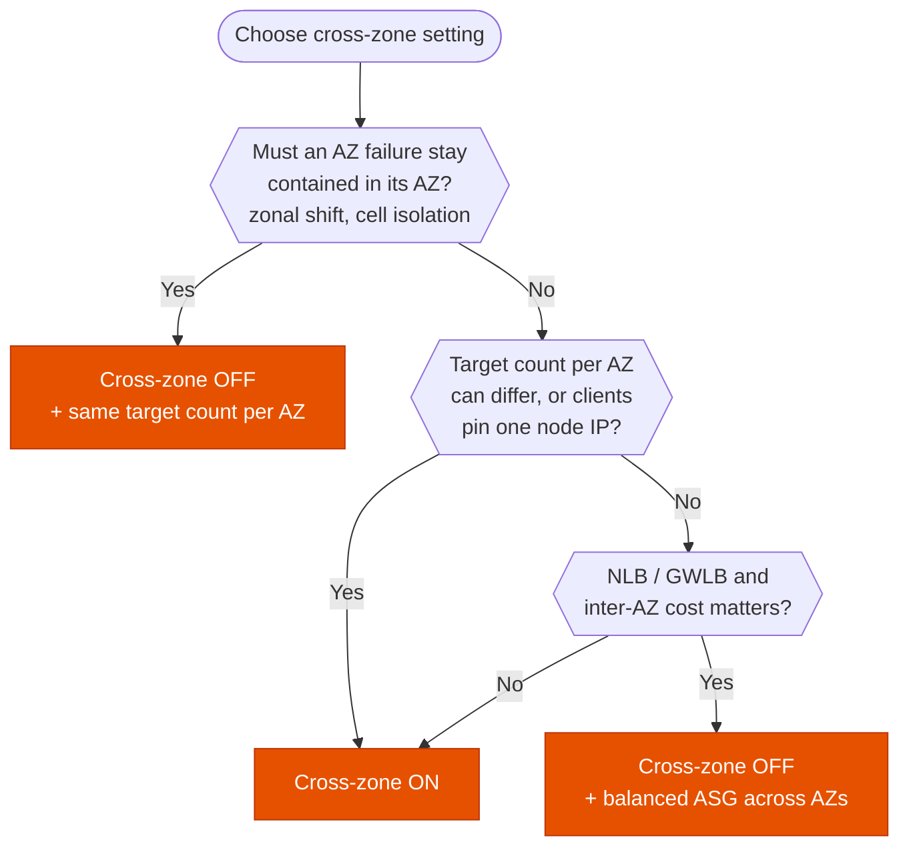

---
tags:
  - "Domain 2: New Solutions"
  - "Domain 3: Continuous Improvement"
  - Elastic Load Balancing
  - Networking
---

# Cross-zone load balancing: how is traffic spread across targets?

**The question:** targets behind a load balancer get uneven load, or the design must contain an AZ failure, or inter-AZ data costs too much. Should cross-zone load balancing be on or off?

**Trigger keywords:** *"some instances are overloaded while others are idle"*, *"uneven number of instances per AZ"*, *"distribute evenly across all targets"*, *"inter-AZ data transfer charges"*, *"isolate an Availability Zone"*, *"zonal shift"*, *"clients cache the IP address"*.

## Fundamentals

- A load balancer has **one node per enabled AZ**. Its DNS name returns the IP of every node, so clients spread roughly evenly **across nodes**, i.e. across AZs.
- **Cross-zone off:** each node sends traffic only to targets **in its own AZ**.
- **Cross-zone on:** each node sends traffic to targets **in all enabled AZs**.
- Within a node, the **routing algorithm** picks the target: ALB uses round robin (default), least outstanding requests, or weighted random. NLB hashes the flow (protocol, IPs, ports), so one TCP connection always lands on the same target.

Example: AZ-a has 2 targets, AZ-b has 8. Each node receives 50% of the traffic.

| | Each target in AZ-a | Each target in AZ-b |
|---|---|---|
| Cross-zone **off** | 50% / 2 = **25%** | 50% / 8 = **6.25%** |
| Cross-zone **on** | 100% / 10 = **10%** | 100% / 10 = **10%** |

**Defaults and cost**

| | Default | Inter-AZ data charge when on | Where to change it |
|---|---|---|---|
| **ALB** | On | ❌ free | Can be turned off **per target group** |
| **NLB** | Off | ✅ charged | Load balancer or target group |
| **GWLB** | Off | ✅ charged | Load balancer |
| **CLB** | On from the console, off from API/CLI | ❌ free | Load balancer |

## Decision tree

## Why each branch

- **Uneven targets → on.** With cross-zone off, every AZ gets the same share whatever its capacity. A smaller AZ gets overloaded.
- **Clients stuck on one node → on.** Clients that cache one DNS answer, or hard-code one of the NLB's static IPs, send everything to one node. Without cross-zone, only that AZ's targets work.
- **AZ isolation → off.** With cross-zone on, a failure in one AZ still receives traffic from the other nodes. Turning it off keeps each AZ independent, which is what zonal shift (ARC) and cell-based designs rely on. Keep the AZs balanced, for example with an Auto Scaling group across all AZs.
- **NLB/GWLB cost → off.** Turning cross-zone on for an NLB or GWLB makes you pay for traffic crossing AZs. On ALB it's free, so cost is never a reason there.

## Comparison

| | Cross-zone on | Cross-zone off |
|---|---|---|
| Load per target | Even across all targets | Even per AZ, uneven per target if counts differ |
| AZ failure blast radius | Traffic from all nodes reaches the impaired AZ | Contained to the AZ's node |
| Inter-AZ data (NLB, GWLB) | Charged | None |
| Requirement | None | Same capacity in every AZ |

## Exam traps

!!! warning "Uneven load on an NLB"
    *"Instances in one AZ are overloaded behind an NLB"*: NLB cross-zone is **off by default**. Turn it on (accepting inter-AZ charges) or rebalance the targets across AZs.

!!! warning "Adding instances doesn't fix the hot AZ"
    With cross-zone off, adding instances to the busy AZs doesn't help the AZ with too few targets. Scale or rebalance in the AZ that's short, or turn cross-zone on.

!!! warning "Cross-zone isn't sticky sessions"
    Users bouncing between targets is a stickiness question (ALB cookies, NLB flow hash), not a cross-zone one.

!!! warning "Disabling cross-zone on ALB"
    It can't be turned off at the ALB level, only on a **target group**.

## Test yourself

??? question "1. An NLB spreads traffic across 3 AZs with 2, 2 and 6 instances. The 2-instance AZs show 90% CPU, the other one 30%. Simplest fix?"
    **Turn on cross-zone load balancing** on the NLB (or its target group). Each instance then receives 10% of the traffic. Inter-AZ data becomes billable.

??? question "2. Partners hard-code one of the NLB's Elastic IPs in their firewall rules and app. Only one AZ's targets get traffic. Why, and what do you change?"
    All traffic hits the node in one AZ, and cross-zone is off. **Turn on cross-zone** so that node uses targets in every AZ.

??? question "3. A team wants to use ARC zonal shift to drain an impaired AZ behind an ALB, without the other AZs' nodes still sending traffic to it. What setting supports this?"
    **Cross-zone off on the target group**, with the same capacity in each AZ so the remaining AZs can absorb the load.

??? question "4. An ALB has cross-zone on. Finance asks to turn it off to save on inter-AZ data. Good idea?"
    No: on ALB, cross-zone traffic is **not charged**. Turning it off saves nothing and risks uneven load.

## Related

- [IPv6 with Elastic Load Balancing](elb-ipv6.md)
- AWS docs: [Cross-zone load balancing](https://docs.aws.amazon.com/elasticloadbalancing/latest/userguide/how-elastic-load-balancing-works.html#cross-zone-load-balancing)
- AWS docs: [Zonal shift in ARC](https://docs.aws.amazon.com/r53recovery/latest/dg/arc-zonal-shift.html)
