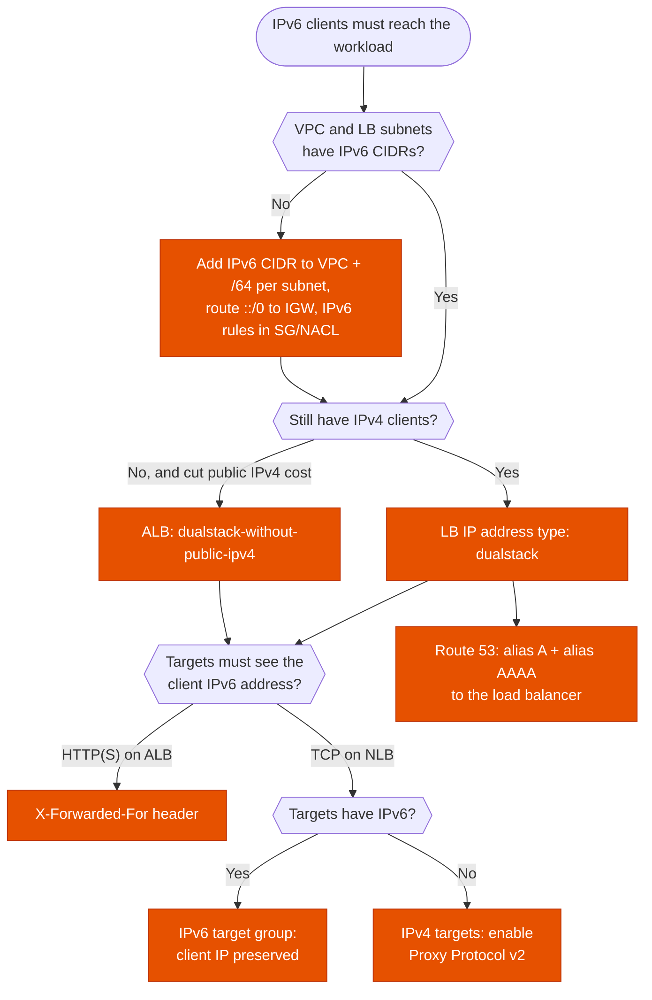

---
tags:
  - "Domain 2: New Solutions"
  - "Domain 3: Continuous Improvement"
  - Elastic Load Balancing
  - IPv6
  - Networking
---

# IPv6 with Elastic Load Balancing

**The question:** clients must reach a workload over IPv6, or the company wants to stop paying for public IPv4 addresses. Which load balancer, which IP address type, and what has to change in the VPC?

**Trigger keywords:** *"IPv6 clients"*, *"mobile networks are IPv6-only"*, *"dual-stack"*, *"reduce public IPv4 costs"*, *"AAAA record"*, *"IPv6 targets"*, *"preserve the client IPv6 address"*.

## Fundamentals

**IPv6 in a VPC**

- IPv6 is **opt-in**: associate an IPv6 CIDR (/56, Amazon-provided, BYOIP or IPAM pool) to the VPC, then a /64 to each subnet.
- Every IPv6 address is globally unique: there is **no NAT for IPv6**. Reachability is controlled by routes, security groups and NACLs.
- **Internet gateway** + route `::/0`: inbound and outbound. **Egress-only internet gateway** + route `::/0`: outbound only (the IPv6 equivalent of a NAT gateway's effect).
- IPv6-only workloads reach IPv4-only destinations through **DNS64 + NAT64** (Route 53 Resolver on the subnet + a NAT gateway, route `64:ff9b::/96`).
- Security groups and NACLs have **separate IPv6 rules**: `0.0.0.0/0` doesn't match IPv6 traffic, you also need `::/0`.

**Load balancer IP address types**

| IP address type | Clients | Supported by |
|---|---|---|
| `ipv4` | IPv4 only | ALB, NLB, GWLB |
| `dualstack` | IPv4 and IPv6. The DNS name returns **A and AAAA** records | ALB, NLB, GWLB |
| `dualstack-without-public-ipv4` | **IPv6 only from the internet**, no public IPv4 billed. Nodes keep private IPv4 addresses | Internet-facing ALB |

**Target group IP address type** is separate: `ipv4` or `ipv6`. An IPv6 target group can only be attached to a **dualstack** load balancer. Classic Load Balancer doesn't support IPv6 in a VPC.

## Decision tree

## Why each branch

- **VPC first.** The load balancer gets IPv6 addresses from its subnets. With no IPv6 CIDR on the subnets, `dualstack` can't be selected.
- **Dualstack is the default answer.** It adds IPv6 without breaking IPv4 clients, and the backend can stay IPv4: the load balancer terminates the client connection and opens a new one to the targets. No application change.
- **No public IPv4 → `dualstack-without-public-ipv4`.** Public IPv4 addresses are billed hourly. This type removes them from an internet-facing ALB, at the price of losing IPv4 clients. To keep serving IPv4 clients, put CloudFront or Global Accelerator in front.
- **Client IP on ALB → `X-Forwarded-For`.** ALB is a proxy at layer 7, so the source IP seen by targets is always the ALB node. The client's IPv6 address is in the header.
- **Client IP on NLB.** With IPv6 target groups, the NLB preserves the client's IPv6 address. With IPv4 targets behind a dualstack NLB, the NLB translates IPv6 to IPv4, so the source is the NLB's private IPv4 address: enable **Proxy Protocol v2** to pass the original address.
- **DNS needs two records.** A Route 53 alias **A** record only answers IPv4. Add an alias **AAAA** record pointing to the same load balancer, or IPv6 clients won't get an address.

## Comparison

| | ALB | NLB | CLB |
|---|---|---|---|
| `dualstack` | ✅ | ✅ | ❌ in a VPC |
| `dualstack-without-public-ipv4` | ✅ internet-facing | ❌ | ❌ |
| IPv6 target groups | ✅ | ✅ | ❌ |
| Client IPv6 visible to targets | `X-Forwarded-For` | Preserved (IPv6 targets) or Proxy Protocol v2 (IPv4 targets, TCP/TLS) | ❌ |

## Exam traps

!!! warning "Switching the LB to dualstack isn't enough"
    IPv6 clients still time out if the security group of the load balancer only allows `0.0.0.0/0`, or if the subnets' route table has no `::/0` route to the internet gateway. Check SG, NACL and routes.

!!! warning "Forgetting the AAAA record"
    The load balancer is dualstack, but the custom domain only has an alias A record. IPv6-only clients can't resolve it.

!!! warning "Rebuilding the backend for IPv6"
    *"Least effort to support IPv6 clients"*: the targets can stay IPv4. A dualstack ALB or NLB in front is enough. Migrating instances to IPv6 is not required.

!!! warning "Egress-only internet gateway for a public service"
    An egress-only IGW blocks connections initiated from the internet. A load balancer serving IPv6 clients needs a regular internet gateway.

!!! warning "Classic Load Balancer"
    A scenario on a CLB that must support IPv6 means migrating to ALB or NLB.

## Test yourself

??? question "1. A mobile app's users are increasingly on IPv6-only carrier networks. The API runs on EC2 (IPv4 only) behind an internet-facing ALB. What's the least effort change?"
    Add IPv6 CIDRs to the VPC and the ALB's subnets, route `::/0` to the internet gateway, set the ALB to **dualstack**, allow `::/0` in its security group, and add an **alias AAAA** record. The instances stay IPv4.

??? question "2. Finance wants to stop paying for public IPv4 addresses on an internet-facing ALB. All clients support IPv6. What do you change?"
    Set the ALB IP address type to **`dualstack-without-public-ipv4`**.

??? question "3. A TCP game server runs behind a dualstack NLB with IPv4 targets. The server must log each player's IPv6 address. What do you configure?"
    **Proxy Protocol v2** on the target group, or move the targets to an **IPv6 target group** so the NLB preserves the client address.

??? question "4. After switching an ALB to dualstack, IPv4 clients work but IPv6 clients time out. DNS returns an AAAA record. What do you check?"
    The ALB **security group** (inbound `::/0` on the listener port), the subnets' **NACL** IPv6 rules, and a **`::/0` route** to the internet gateway in the subnets' route table.

## Related

- [Cross-zone load balancing](elb-cross-zone.md)
- AWS docs: [ALB IP address types](https://docs.aws.amazon.com/elasticloadbalancing/latest/application/application-load-balancers.html#ip-address-type)
- AWS docs: [NLB IP address types](https://docs.aws.amazon.com/elasticloadbalancing/latest/network/network-load-balancers.html#ip-address-type)
- AWS docs: [IPv6 on AWS (whitepaper)](https://docs.aws.amazon.com/whitepapers/latest/ipv6-on-aws/IPv6-on-AWS.html)
