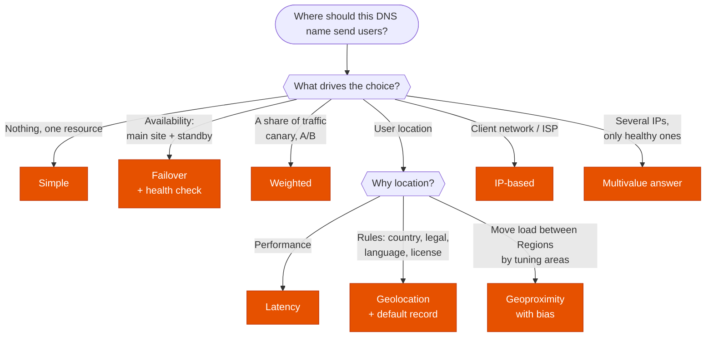

---
tags:
  - "Domain 2: New Solutions"
  - "Domain 3: Continuous Improvement"
  - Route 53
  - Networking
---

# Route 53: which routing policy?

**The question:** a DNS name must send users to the right endpoint. Which routing policy: simple, weighted, latency, failover, geolocation, geoproximity, IP-based or multivalue answer?

**Trigger keywords:** *"lowest latency for users worldwide"*, *"content restricted by country"*, *"GDPR: EU users stay in the EU"*, *"active-passive / DR site"*, *"send 10% of traffic to the new version"*, *"shift traffic gradually between Regions"*, *"route by ISP / client IP range"*, *"return several healthy IPs"*.

## Fundamentals

| Policy | Answers with | Health checks | Use it when |
|---|---|---|---|
| **Simple** | One record, all its values (client picks one at random) | ❌ | One resource, no routing logic |
| **Weighted** | Records in proportion to their **weight** (0–255) | ✅ | Canary / blue-green, A/B tests, split between Regions |
| **Latency** | The Region with the **lowest measured latency** to the user | ✅ | Global app in several Regions, performance first |
| **Failover** | **Primary** while healthy, otherwise **secondary** | ✅ (required on primary) | Active-passive DR |
| **Geolocation** | By the user's **continent, country or US state** | ✅ | Compliance, localized content, licensing by country |
| **Geoproximity** | By **distance** to the resource, adjusted by a **bias** (-99 to +99) | ✅ | Shift traffic between Regions by growing / shrinking an area |
| **IP-based** | By the client's **source CIDR** (CIDR collections) | ✅ | Route by ISP or known networks, cost or performance |
| **Multivalue answer** | Up to **8 healthy** records, random | ✅ | Simple client-side load spreading with health checks |

- **Health checks** run from public checkers around the world: **endpoint** (HTTP/HTTPS/TCP, optional string match), **calculated** (combine other checks), **CloudWatch alarm** (the only way to check a **private** resource).
- **Alias records:** point to AWS resources (ELB, CloudFront, S3 website, API Gateway, another record…), work at the **zone apex**, free queries, and **Evaluate Target Health** replaces a health check.
- **Policies nest:** e.g. latency between Regions, then weighted inside each Region, then failover. **Traffic Flow** builds these trees visually (with versioning).
- **TTL** limits how fast a change is seen. Lower it before a migration or failover test.

## Decision tree

## Why each branch

- **Latency vs geolocation.** Latency is about **speed**: the closest Region on the network, which can change over time. Geolocation is about **rules**: a French user always goes to the record for France. *"Must"* + country → geolocation.
- **Geolocation needs a default record.** Users whose location matches no record (or can't be determined) get **no answer** otherwise.
- **Geoproximity** is the only one where you **tune** the area served: a positive bias grows a Region's area, so it takes more traffic.
- **Failover = active-passive.** For **active-active**, use weighted, latency or multivalue with health checks: unhealthy records are simply dropped from answers.
- **Weighted with weight 0** stops traffic to a record without deleting it (unless every record is 0, then all are used equally).
- **Multivalue is not a load balancer.** It returns up to 8 healthy IPs; the client chooses. For real load balancing, put an ELB behind an alias.

## Exam traps

!!! warning "Geolocation for the lowest latency"
    The nearest country isn't always the fastest Region. *"Best performance"* → **latency**. *"Users in country X must…"* → **geolocation**.

!!! warning "Health checks on private resources"
    Route 53 health checkers are on the internet and can't reach a private IP. Create a **CloudWatch alarm** on a metric of the resource and a health check based on that alarm.

!!! warning "Simple routing with health checks"
    Simple records can't be associated with health checks. A *"return only healthy endpoints"* requirement needs **multivalue answer** (or another policy).

!!! warning "CNAME at the zone apex"
    `example.com` can't be a CNAME. Use an **alias** record to the ELB or CloudFront distribution.

!!! warning "Failover doesn't happen fast"
    Clients and resolvers cache the answer for the **TTL**. For near-instant failover without DNS caching, look at **Global Accelerator** (static anycast IPs).

## Test yourself

??? question "1. An app runs in us-east-1 and eu-west-1. Users must get the fastest response. Which policy?"
    **Latency** routing, with health checks so an unhealthy Region is skipped.

??? question "2. For legal reasons, users in Germany must only reach the Frankfurt deployment. Everyone else goes to us-east-1."
    **Geolocation**: a record for Germany → Frankfurt, and a **default** record → us-east-1.

??? question "3. A team wants to send 5% of traffic to a new version in another stack, then increase gradually."
    **Weighted** routing: weights 95 / 5, then adjust. Lower the TTL first.

??? question "4. A primary site in one Region and a static S3 maintenance page as DR. Which setup?"
    **Failover** routing: primary alias to the ALB with health check (or Evaluate Target Health), secondary alias to the **S3 website** endpoint.

??? question "5. A company wants to move more European traffic to its new eu-central-1 Region without changing its other records."
    **Geoproximity** with a positive **bias** on eu-central-1.

??? question "6. A video provider gets lower transit costs when users of a specific ISP are served by a given endpoint."
    **IP-based** routing with a CIDR collection containing that ISP's ranges.

## Related

- [Cross-zone load balancing](elb-cross-zone.md)
- AWS docs: [Choosing a routing policy](https://docs.aws.amazon.com/Route53/latest/DeveloperGuide/routing-policy.html)
- AWS docs: [Route 53 health checks](https://docs.aws.amazon.com/Route53/latest/DeveloperGuide/dns-failover.html)
