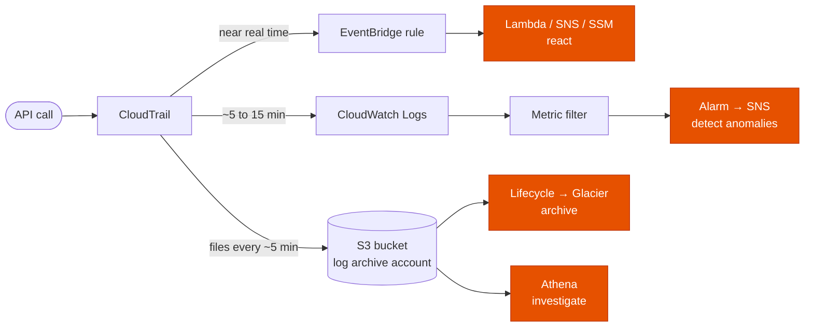
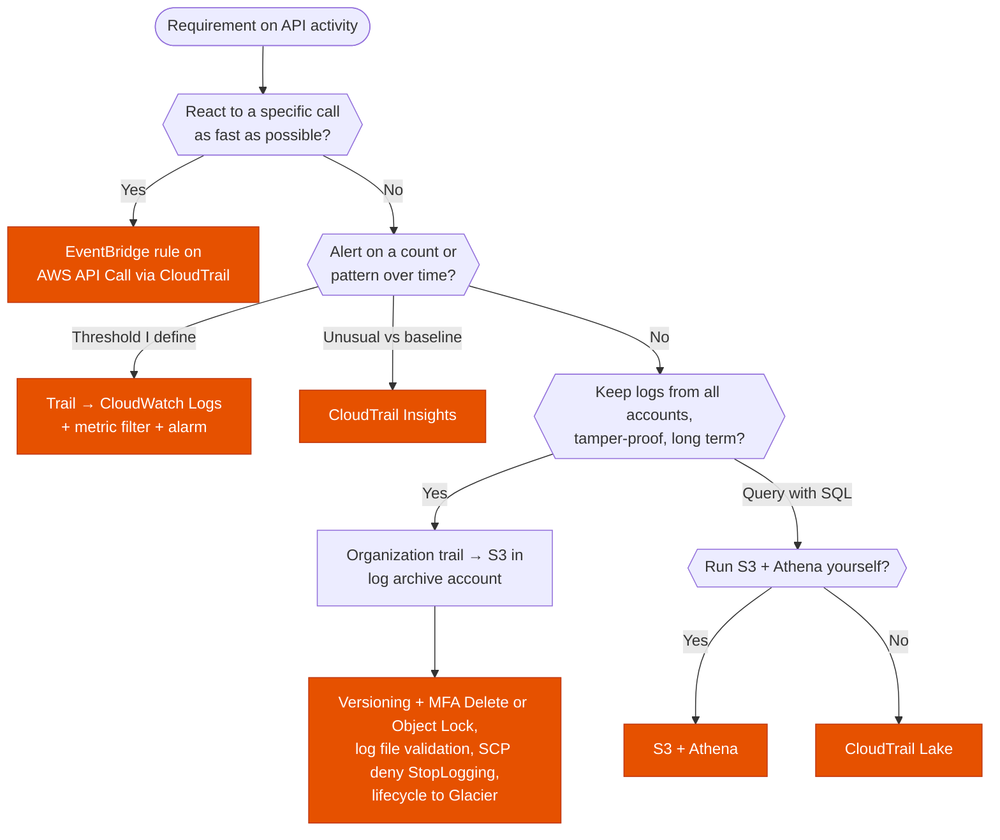

---
tags:
  - "Domain 1: Organizational Complexity"
  - "Domain 3: Continuous Improvement"
  - CloudTrail
  - EventBridge
  - Security
---

# CloudTrail: react, alert or keep the logs?

**The question:** API activity must be detected, alerted on, or kept as evidence. Where should CloudTrail send its events: EventBridge, CloudWatch Logs or S3?

**Trigger keywords:** *"react immediately when someone calls X"*, *"near real time"*, *"alarm when there are too many unauthorized API calls"*, *"root user signs in"*, *"centralize logs from all accounts"*, *"logs must not be tampered with"*, *"retain for 7 years"*, *"query the logs"*.

## Fundamentals

| Destination | Latency | Use it to |
|---|---|---|
| **Event history** | ~minutes | Look up the last **90 days** of management events, per Region. Free, no trail needed |
| **EventBridge** | **Near real time**: doesn't wait for the S3 log file | **React** to one API call: rule → Lambda, SNS, SSM Automation, Step Functions |
| **CloudWatch Logs** | Same as the trail delivery | **Count** events with **metric filters** + **alarms** (e.g. failed console logins, `UnauthorizedOperation`, root usage) |
| **S3 (trail)** | Log files about **every 5 minutes**. An event usually lands within ~5 min, **up to ~15 min**, not guaranteed | **Keep** the logs: central, cross-account, cheap, queried with Athena |
| **CloudTrail Lake** | Minutes | Query events with SQL over multi-year retention, without managing S3 + Athena |

- **Management events** (control plane: `CreateBucket`, `RunInstances`…) are logged by default. **Data events** (`GetObject`, Lambda `Invoke`, DynamoDB items…) must be enabled on the trail and cost extra.
- **CloudTrail Insights** detects unusual **volume or error rate** of API calls compared to the account's baseline: built-in anomaly detection, no threshold to set.
- **Organization trail:** created in the management account (or a delegated administrator), logs every account of the organization into one bucket. Member accounts can't stop or edit it.

## Decision tree

## Why each branch

- **React → EventBridge.** It receives the event without waiting for the log file to be written to S3 or CloudWatch Logs. It's the most reactive option, and the target can remediate automatically (e.g. Lambda re-enables a disabled trail, or reverts a security group change).
- **Count → CloudWatch Logs.** EventBridge matches single events: it can't say *"more than 5 failed logins in 5 minutes"*. A metric filter turns matching log lines into a metric, and an alarm fires on the threshold. The trail needs an IAM role to write to the log group.
- **Unusual activity → Insights.** When the stem says *"unusual"* or *"anomalous"* without giving a threshold, CloudTrail Insights learns the baseline for you.
- **Evidence → S3 in another account.** A bucket in the log archive account, written by an organization trail, keeps logs out of reach of workload account admins. The bucket policy allows `cloudtrail.amazonaws.com` to write, scoped with `aws:SourceArn`.
- **Tamper-proof.** **Versioning + MFA Delete** stops silent deletion and overwrite (MFA Delete is enabled by the root user, via CLI/API only). **Object Lock** in compliance mode is stronger: WORM, nobody can delete before retention ends. **Log file integrity validation** adds hourly signed digest files to prove a log wasn't modified. An **SCP** denies `cloudtrail:StopLogging` and `DeleteTrail`.
- **Archive → lifecycle.** Move old logs to S3 Glacier storage classes. Keep a retention that matches the compliance requirement.

## Comparison

| | EventBridge | CloudWatch Logs | S3 | CloudTrail Lake |
|---|---|---|---|---|
| Speed | Fastest | ~5–15 min | ~5–15 min | Minutes |
| Single event | ✅ | ✅ (filter) | ❌ | ❌ |
| Count / threshold | ❌ | ✅ metric filter + alarm | ❌ | ❌ |
| Long-term, cheap retention | ❌ | Costly | ✅ + Glacier | Paid per ingestion |
| Query | ❌ | Logs Insights | Athena | SQL built in |
| Cross-account central | Event bus forwarding | Log group per account (or centralized subscription) | ✅ org trail | ✅ org event data store |

## Exam traps

!!! warning "Waiting for S3 to react"
    *"Respond as quickly as possible"*: a Lambda triggered by S3 `PutObject` on the log bucket waits for the log file (up to ~15 min). **EventBridge** is the answer.

!!! warning "EventBridge for thresholds"
    *"Alert when more than N…"* needs a **CloudWatch metric filter + alarm**. EventBridge has no counting.

!!! warning "Read-only calls don't reach EventBridge by default"
    `Get*`, `List*`, `Describe*` events are only sent to a rule that explicitly opts in to all management events. Write calls are sent by default.

!!! warning "Data events aren't on by default"
    *"Who downloaded this S3 object?"* needs **S3 data events** on the trail (or S3 server access logs). Management events alone won't show `GetObject`.

!!! warning "MFA Delete isn't WORM"
    MFA Delete makes deletion harder, but the root user with MFA can still delete. *"Nobody can delete for 7 years"* means **Object Lock compliance mode**.

## Test yourself

??? question "1. Security wants a security group opened to 0.0.0.0/0 to be reverted within seconds, in every account. What do you build?"
    An **EventBridge rule** on `AuthorizeSecurityGroupIngress` (AWS API Call via CloudTrail) targeting a **Lambda** that revokes the rule. Deploy it to all accounts with StackSets, or forward events to a central event bus.

??? question "2. The CISO wants an email when more than 10 `AccessDenied` errors happen in 5 minutes. Which option?"
    Trail → **CloudWatch Logs**, **metric filter** on `errorCode = AccessDenied`, **alarm** with a threshold of 10 over 5 minutes → **SNS**.

??? question "3. Auditors require CloudTrail logs from 150 accounts in one place, kept 7 years, and proof that no file was altered. Design?"
    **Organization trail** → S3 bucket in the **log archive account**, **log file integrity validation** on, **Object Lock** (compliance mode, 7 years) or at least versioning + MFA Delete, **lifecycle to Glacier**, and an **SCP** denying `StopLogging` / `DeleteTrail`.

??? question "4. Nobody knows what normal API activity looks like, but the team wants to be told when something unusual happens. Least effort?"
    **CloudTrail Insights** on the trail.

## Related

- [Will this request be allowed?](../identity/policy-evaluation.md): the SCP that protects CloudTrail
- [Backup: DLM vs AWS Backup vs native](../storage/backup-strategy.md): same WORM logic with Vault Lock
- AWS docs: [Receiving CloudTrail events with EventBridge](https://docs.aws.amazon.com/eventbridge/latest/userguide/eb-service-event-cloudtrail.html)
- AWS docs: [Monitoring CloudTrail log files with CloudWatch Logs](https://docs.aws.amazon.com/awscloudtrail/latest/userguide/monitor-cloudtrail-log-files-with-cloudwatch-logs.html)
