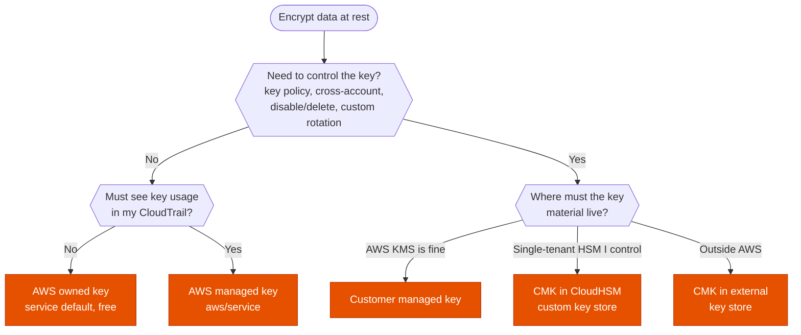

---
tags:
  - "Domain 1: Organizational Complexity"
  - "Domain 2: New Solutions"
  - KMS
  - Security
---

# KMS key types: AWS owned, AWS managed or customer managed?

**The question:** data must be encrypted at rest. Is the service's default key enough, or do you need a customer managed key (and where should its key material live)?

**Trigger keywords:** *"control the key policy"*, *"share encrypted snapshots with another account"*, *"rotate the key every 90 days"*, *"audit every use of the key"*, *"disable the key to revoke access"*, *"keys must stay in a dedicated HSM"*, *"keys must stay outside AWS"*, *"no extra cost"*.

## Fundamentals

| KMS key | Customer managed key | AWS managed key | AWS owned key |
|---|---|---|---|
| Example | A key you create, alias of your choice | `aws/s3`, `aws/ebs`, `aws/rds`… | SSE-S3, default DynamoDB and SQS encryption |
| Can view metadata? | ✅ | ✅ | ❌ |
| Can manage? (key policy, enable/disable, delete) | ✅ | ❌ | ❌ |
| Used only for my AWS account? | ✅ | ✅ | ❌ shared across accounts |
| Usage visible in my CloudTrail? | ✅ | ✅ | ❌ |
| Cross-account use | ✅ via the key policy | ❌ policy can't be edited | ❌ |
| Automatic rotation | Optional: **90 – 2560 days** (365 default) | **Required, every year** | Varies, managed by AWS |
| On-demand rotation | ✅ | ❌ | ❌ |
| Cost | $1/month per key + requests | No monthly fee, requests charged | Free |

- **Rotation keeps the key ID and ARN.** KMS keeps the old key material to decrypt older data, so nothing has to be re-encrypted. Automatic rotation applies to **symmetric keys with KMS-generated material**. Asymmetric, HMAC and imported keys are rotated manually: create a new key and move the **alias**.
- **Key stores:** a customer managed key can live in the default KMS store, in a **CloudHSM custom key store** (single-tenant HSM you control), or in an **external key store (XKS)** whose material never leaves your own HSM outside AWS.

## Decision tree

## Why each branch

- **No control needed → service default.** AWS owned keys cost nothing and need nothing. AWS managed keys add visibility: you see the key and its use in CloudTrail, but you can't change it.
- **Control → customer managed key.** It's the only type whose **key policy** you write. That's what makes cross-account access, separation of duties (admins vs users), revoking access by disabling the key, and a custom rotation period possible.
- **Compliance on the key material → custom key store.** *"FIPS 140 Level 3 HSM we control"* or *"single tenant"* points to CloudHSM. *"Keys must never leave our data center"* points to an external key store. Both keep the KMS API, so integrated services still work.

## Exam traps

!!! warning "Sharing snapshots encrypted with an AWS managed key"
    EBS or RDS snapshots encrypted with `aws/ebs` or `aws/rds` can't be shared with another account: that key's policy can't be edited. Copy the snapshot with a **customer managed key**, then share both. Same trap as [cross-account backup copies](../storage/backup-strategy.md).

!!! warning "Rotation doesn't need re-encryption"
    *"Rotate the key yearly with the least effort"*: turn on automatic rotation. Old data stays readable, no re-encryption job is needed.

!!! warning "Rotating every 90 days"
    AWS managed keys rotate yearly and can't be changed. A shorter period means a **customer managed key** with a custom rotation period.

!!! warning "Imported key material"
    Automatic rotation isn't available for imported key material. Rotate by creating a new key and moving the alias.

## Test yourself

??? question "1. A company wants to share encrypted AMIs with a partner account. The EBS volumes use the default EBS encryption key. What must change?"
    The default key is the AWS managed `aws/ebs`, which can't be shared. Copy the AMI re-encrypted with a **customer managed key**, grant the partner account in its key policy, then share the AMI.

??? question "2. Security must be able to cut off all access to an S3 dataset immediately, even for admins with full S3 permissions. Which key type?"
    **Customer managed key** (SSE-KMS). Disabling the key, or removing grants from the key policy, makes the objects unreadable.

??? question "3. A regulator requires keys in a single-tenant, FIPS 140-3 Level 3 HSM controlled by the company, while still using SSE-KMS on S3. Design?"
    **Customer managed key in a CloudHSM custom key store.** S3 keeps calling KMS as usual.

??? question "4. A startup wants encryption at rest on DynamoDB at no extra cost and with no key management. What does it pick?"
    The **AWS owned key** (the DynamoDB default).

## Related

- [Cross-account access](../identity/cross-account-access.md)
- [Backup: DLM vs AWS Backup vs native](../storage/backup-strategy.md)
- AWS docs: [AWS KMS keys](https://docs.aws.amazon.com/kms/latest/developerguide/concepts.html#kms_keys)
- AWS docs: [Rotating AWS KMS keys](https://docs.aws.amazon.com/kms/latest/developerguide/rotate-keys.html)
