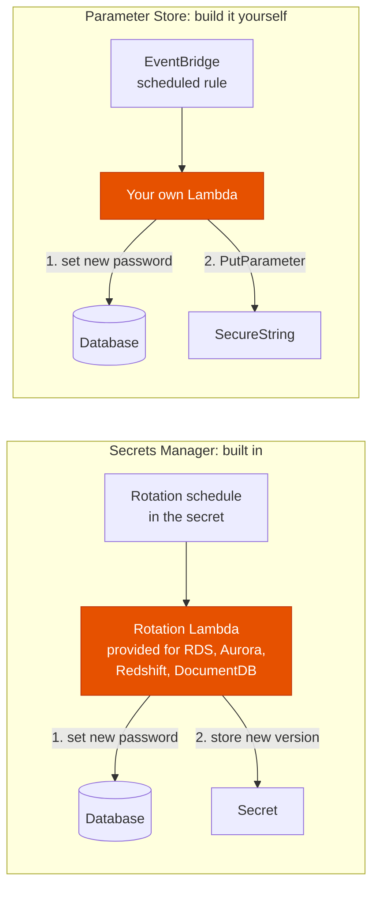
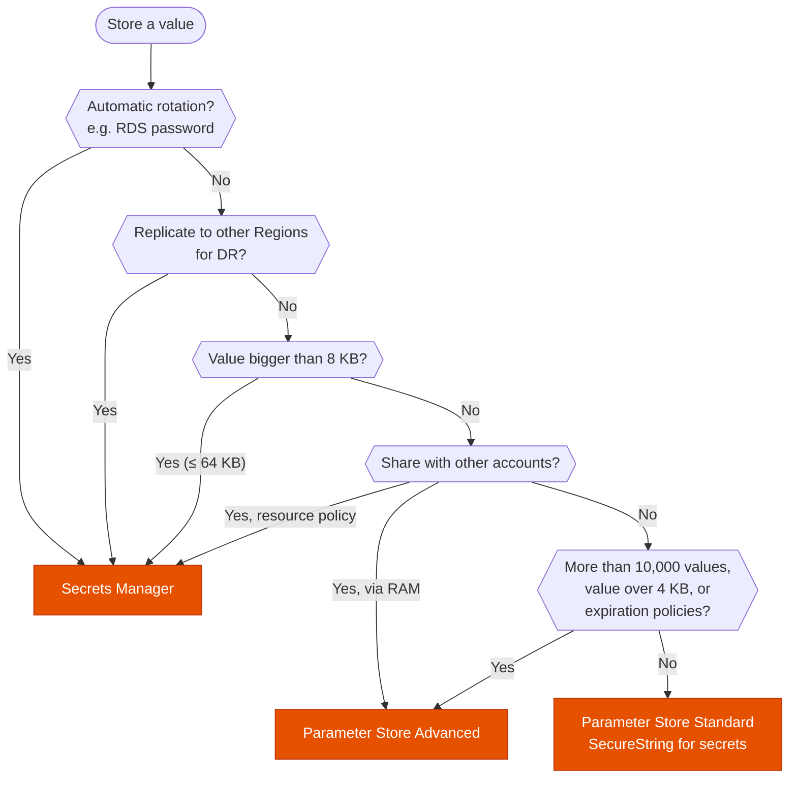

---
tags:
  - "Domain 2: New Solutions"
  - "Domain 3: Continuous Improvement"
  - Secrets Manager
  - Systems Manager
  - Security
---

# Secrets Manager vs Parameter Store (Standard or Advanced)?

**The question:** an application needs a password, an API key or configuration values. Where do you store them: Parameter Store Standard, Parameter Store Advanced, or Secrets Manager?

**Trigger keywords:** *"rotate the database password automatically"*, *"replicate the secret to another Region"*, *"share with another account"*, *"most cost-effective"*, *"configuration values"*, *"hierarchy"*, *"expire the value"*, *"more than 10,000 parameters"*, *"larger than 4 KB"*.

## Fundamentals

| | Parameter Store **Standard** | Parameter Store **Advanced** | **Secrets Manager** |
|---|---|---|---|
| Made for | Config + simple secrets | Same, at larger scale | Secrets with a lifecycle |
| Cost | **Free** (storage) | $0.05 per parameter/month | **$0.40 per secret/month** + API calls |
| Max per account/Region | 10,000 | 100,000 | 500,000 |
| Max value size | **4 KB** | **8 KB** | **64 KB** |
| Encryption | Optional: `SecureString` with KMS | Optional: `SecureString` with KMS | Always, with KMS |
| Automatic rotation | ❌ | ❌ | ✅ Lambda, native for RDS, Aurora, Redshift, DocumentDB |
| Parameter policies (expiration, notifications) | ❌ | ✅ via EventBridge | n/a (rotation instead) |
| Cross-account | ❌ | ✅ shared with **AWS RAM** | ✅ **resource policy** + CMK |
| Multi-Region replication | ❌ | ❌ | ✅ replica secrets |
| Generate random passwords | ❌ | ❌ | ✅ |

- **Standard → Advanced** is a one-way upgrade. Going back means deleting and recreating the parameter.
- Parameter Store organizes values in a **path hierarchy** (`/prod/app/db-url`) readable with `GetParametersByPath`, and IAM can restrict access by path.
- Both work with CloudFormation **dynamic references** (`{{resolve:ssm:…}}`, `{{resolve:secretsmanager:…}}`), ECS task definitions and Lambda.
- Parameter Store can read a Secrets Manager secret through `/aws/reference/secretsmanager/<name>`: one API for both.

**In one line each**

- **Secrets Manager ($$$):** secrets with a lifecycle. Rotation built in, KMS encryption **mandatory**.
- **Parameter Store ($):** simple key/value API for config and static secrets. No rotation, KMS encryption **optional** (`SecureString`).

**How rotation works**

With Secrets Manager the Lambda, its permissions and the versioning (`AWSCURRENT`, `AWSPENDING`, `AWSPREVIOUS`) are handled for you. With Parameter Store you write, test and maintain all of it: that's the *"operational overhead"* the exam penalizes.

## Decision tree

## Why each branch

- **Rotation → Secrets Manager.** It's the only one that rotates: a Lambda (provided by AWS for RDS, Aurora, Redshift, DocumentDB) changes the password in the database and in the secret together. Parameter Store would need your own EventBridge + Lambda solution.
- **Multi-Region DR → Secrets Manager.** Replica secrets stay in sync, so an application failed over to another Region finds the same secret name.
- **Size.** Standard holds 4 KB, Advanced 8 KB, Secrets Manager 64 KB (e.g. a certificate bundle).
- **Cross-account.** Secrets Manager uses a resource policy on the secret, and the secret must use a **customer managed KMS key** (the AWS managed `aws/secretsmanager` key can't be shared). Parameter Store needs the Advanced tier to share through RAM.
- **Scale or lifecycle → Advanced.** More than 10,000 parameters, values between 4 and 8 KB, or parameter policies (expire a value, notify when it's about to expire or hasn't changed).
- **Otherwise → Standard.** Free, and `SecureString` encrypts the value with KMS. It's the *"most cost-effective"* answer when nothing needs rotating.

## Exam traps

!!! warning "Parameter Store can't rotate"
    *"Rotate credentials automatically every 30 days with the least operational overhead"*: Secrets Manager. A Lambda + EventBridge rotating a SecureString works but is more overhead.

!!! warning "Secrets Manager when nothing needs rotating"
    *"Most cost-effective"* storage for a static API key or config: **Parameter Store Standard with SecureString**. Secrets Manager costs $0.40 per secret per month.

!!! warning "Sharing a secret encrypted with the AWS managed key"
    Another account can't decrypt a secret encrypted with `aws/secretsmanager`. Re-encrypt it with a customer managed key, and grant the other account in both the key policy and the secret's resource policy. Same rule as on the [KMS page](kms-key-types.md).

!!! warning "Downgrading Advanced to Standard"
    Not possible in place. You delete and recreate the parameter.

## Test yourself

??? question "1. An Aurora database password must change every 30 days without application downtime. Least effort?"
    **Secrets Manager** with the native Aurora rotation. The application fetches the secret at runtime instead of caching it forever.

??? question "2. A team stores 200 feature flags and URLs, a few API keys, no rotation, and wants to pay as little as possible. Where?"
    **Parameter Store Standard**: `String` for flags and URLs, `SecureString` for the API keys.

??? question "3. A DR plan fails the application over to another Region. The DB credentials must be available there with the same name. Which service?"
    **Secrets Manager** with a **replica secret** in the DR Region.

??? question "4. A platform account holds 25,000 configuration parameters read by workload accounts in the organization. What do you use?"
    **Parameter Store Advanced** (over 10,000 parameters), shared with the workload accounts through **AWS RAM**.

??? question "5. A license key must stop being valid on a fixed date, and ops wants an alert 7 days before. Which option?"
    **Parameter Store Advanced** with an **Expiration** and **ExpirationNotification** parameter policy (event in EventBridge).

## Related

- [KMS key types](kms-key-types.md)
- [Cross-account access](../identity/cross-account-access.md)
- AWS docs: [Parameter Store tiers](https://docs.aws.amazon.com/systems-manager/latest/userguide/parameter-store-advanced-parameters.html)
- AWS docs: [Rotate Secrets Manager secrets](https://docs.aws.amazon.com/secretsmanager/latest/userguide/rotating-secrets.html)
