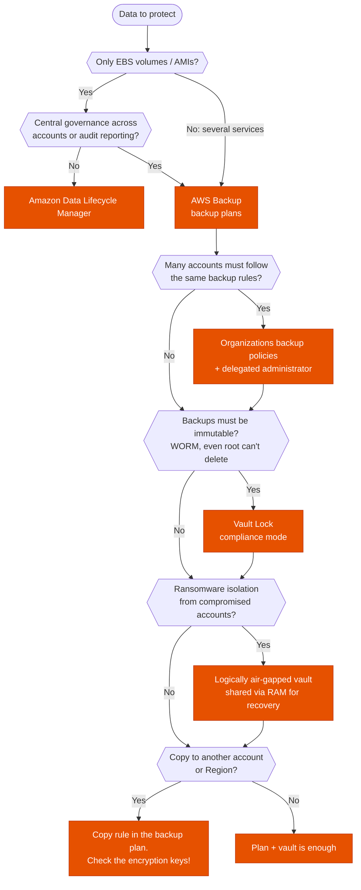
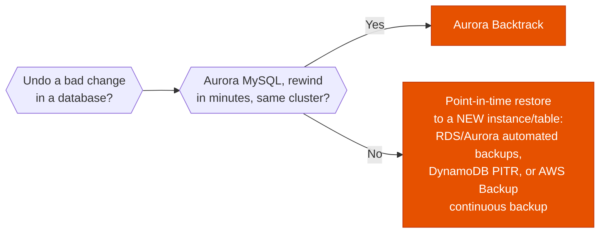

---
tags:
  - "Domain 2: New Solutions"
  - "Domain 3: Continuous Improvement"
  - AWS Backup
  - Storage
---

# Backup: DLM vs AWS Backup vs native backups

**The question:** data has to be backed up with a retention policy. Should it be Amazon Data Lifecycle Manager, AWS Backup, or the service's own backup feature?

**Trigger keywords:** *"automate EBS snapshots"*, *"centralized backup"*, *"across all accounts"*, *"WORM"*, *"immutable"*, *"ransomware"*, *"point-in-time recovery"*, *"compliance report for auditors"*, *"copy backups to another Region / account"*.

## Fundamentals

| Option | Covers | Scope | Key features |
|---|---|---|---|
| **Amazon Data Lifecycle Manager (DLM)** | **EBS snapshots and EBS-backed AMIs only** | One account, one Region, targets chosen by tag | Schedules, retention, cross-Region copy, snapshot archive tier, Fast Snapshot Restore, pre/post scripts via SSM. **Free**: you pay only for snapshot storage |
| **AWS Backup** | EC2, EBS, S3, EFS, FSx (all four), RDS, Aurora, DynamoDB, DocumentDB, Neptune, Redshift, Timestream, Storage Gateway volumes, CloudFormation stacks, SAP HANA on EC2, VMware VMs ([full list](https://docs.aws.amazon.com/aws-backup/latest/devguide/backup-feature-availability.html)) | Central: backup plans per account, **backup policies across the Organization** | Cross-Region and cross-account copy, **Vault Lock** (WORM), **logically air-gapped vaults**, legal holds, **Backup Audit Manager**, restore testing, continuous backup (point-in-time recovery) for RDS, Aurora, S3 and SAP HANA |
| **Native service features** | RDS/Aurora automated backups (PITR up to 35 days), manual snapshots, DynamoDB PITR and on-demand backups, S3 versioning / replication / Object Lock, EFS replication, Aurora Backtrack (MySQL-compatible) | Per resource | Often the fastest recovery path, but each service is configured separately with no central view |

## Decision tree

A separate question is **how fast you need to undo a mistake**:

## Why each branch

- **EBS/AMI only → DLM.** It's free, tag-driven and built into EC2. AWS Backup can also do EBS, so DLM wins only when nothing else needs protecting and there's no central governance requirement.
- **Several services or a single pane → AWS Backup.** One plan (schedule, retention, lifecycle to cold storage, copy rules) applied to resources selected by tag or ARN, across services.
- **Many accounts → backup policies.** A policy in AWS Organizations pushes the same backup plan into every account of an OU. Local admins can't opt out.
- **Immutable → Vault Lock (compliance mode).** After the grace period, nobody can delete recovery points or shorten retention, not even the root user or AWS. Governance mode can still be removed by users with the right permissions.
- **Ransomware → logically air-gapped vault.** Backups are isolated from the source account and can be shared through RAM to a recovery account, so a compromised workload account can't destroy them.
- **Copy → watch the keys.** For services without "full AWS Backup management" (for example RDS, Aurora, EBS), the backup keeps the **source's KMS key**. If that's an AWS-managed key, the cross-account copy fails. Re-encrypt with a customer-managed key first.
- **Restores are always to a new resource.** PITR in RDS or DynamoDB creates a new instance or table. Only Aurora Backtrack rewinds in place.

## Comparison

| | DLM | AWS Backup | Native features |
|---|---|---|---|
| Services | EBS, AMIs | ~20 services + VMware | One each |
| Multi-account governance | ❌ | ✅ Org backup policies | ❌ |
| Cross-account copy | Shared snapshots only | ✅ within the Organization | Manual sharing (RDS/EBS snapshots) |
| WORM | ❌ (EBS snapshot lock is separate) | ✅ Vault Lock | S3 Object Lock for objects |
| Compliance reporting | ❌ | ✅ Backup Audit Manager | ❌ |
| Cost of the service itself | Free | Pay per backup storage/restore | Included / storage |

## Exam traps

!!! warning "DLM can't back up RDS, DynamoDB, EFS…"
    If the scenario mentions anything other than EBS or AMIs, DLM is wrong however cheap it is.

!!! warning "AWS-managed keys block cross-account copies"
    RDS, Aurora and EBS backups inherit the source key. Snapshots encrypted with `aws/rds` or `aws/ebs` can't be copied to another account. The fix is a customer-managed key, which usually means copying or restoring with a CMK first.

!!! warning "Governance mode is not WORM"
    *"Even administrators must not be able to delete backups"* means **compliance** mode. Governance mode can be lifted by privileged users.

!!! warning "Cross-account copy needs AWS Organizations"
    AWS Backup copies between accounts only when both accounts are in the same organization, with cross-account backup enabled from the management account.

## Test yourself

??? question "1. A startup runs 30 EC2 instances in one account and wants daily EBS snapshots kept for 14 days, at the lowest possible cost. Which option?"
    **DLM**, with a policy that targets the instances by tag. It's free and only EBS is involved.

??? question "2. A bank has 200 accounts. Every production RDS, DynamoDB and EFS resource must be backed up daily, kept 7 years, copied to a central account, and nobody (root included) may delete the copies. What do you set up?"
    **AWS Backup backup policies** in Organizations for the production OU, a copy rule to a vault in the central backup account, and **Vault Lock in compliance mode** on that vault. Check that the RDS databases use customer-managed KMS keys, or the cross-account copy fails.

??? question "3. A developer ran a bad UPDATE on an Aurora MySQL cluster 20 minutes ago. The team wants the fastest recovery, without changing the endpoint. Which feature?"
    **Aurora Backtrack** (if it was enabled). It rewinds the cluster in place in minutes. PITR would create a new cluster with a new endpoint.

??? question "4. Security wants backups to survive even if a workload account is fully compromised, and to be restorable from a separate recovery account. What does AWS Backup offer?"
    A **logically air-gapped vault**, shared with the recovery account through AWS RAM.

??? question "5. Auditors ask for continuous evidence that every backup plan meets the company's retention and frequency rules. What do you use?"
    **AWS Backup Audit Manager**, with frameworks and controls that produce compliance reports.

## Related

- [Cross-account access](../identity/cross-account-access.md): the KMS trap is the same
- AWS docs: [AWS Backup feature availability](https://docs.aws.amazon.com/aws-backup/latest/devguide/backup-feature-availability.html)
- AWS docs: [Amazon Data Lifecycle Manager](https://docs.aws.amazon.com/ebs/latest/userguide/snapshot-lifecycle.html)
