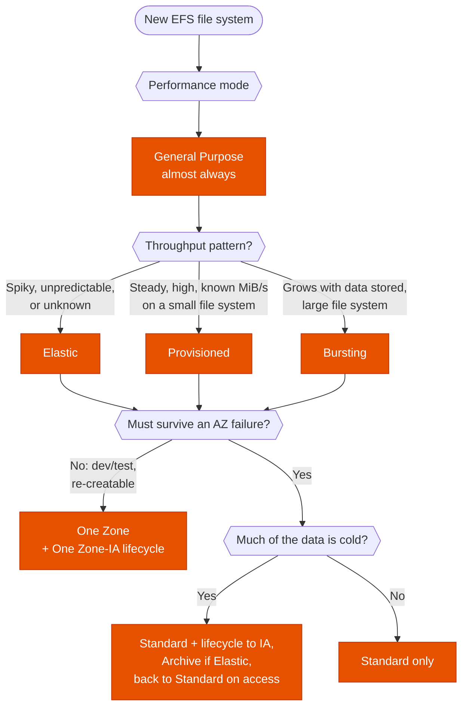

---
tags:
  - "Domain 2: New Solutions"
  - "Domain 3: Continuous Improvement"
  - EFS
  - Storage
---

# EFS: which performance mode, throughput mode and storage class?

**The question:** a workload needs a shared NFS file system on EFS. Which performance mode, which throughput mode, and which storage classes keep it fast enough at the lowest cost?

**Trigger keywords:** *"shared file system across AZs"*, *"thousands of instances"*, *"lowest latency"*, *"spiky / unpredictable throughput"*, *"throughput drops after a while"*, *"burst credits"*, *"small file system, high throughput"*, *"rarely accessed files"*, *"lifecycle policy"*, *"cost-optimize EFS"*, *"dev / test, single AZ is fine"*.

## Fundamentals

Three independent settings:

| Setting | Options | Can change later? |
|---|---|---|
| **Performance mode** | **General Purpose** (default, lowest latency) · **Max I/O** (legacy, higher latency) | ❌ Set at creation |
| **Throughput mode** | **Elastic** (default) · **Provisioned** · **Bursting** | ✅ (24 h wait after switching to Provisioned or lowering it) |
| **Storage class** | Per file, through **lifecycle management** | ✅ Anytime |

### Throughput modes

| Mode | How throughput is set | You pay for | Use it when |
|---|---|---|---|
| **Elastic** | Scales automatically with the workload | **Data transferred** (read / write GB) | ✅ Default. Spiky or unpredictable, or under ~5% average of peak |
| **Provisioned** | You set MiB/s, **independent of storage size** | Provisioned MiB/s above what Bursting would give | Steady, known, high throughput on a **small** file system |
| **Bursting** | Grows with storage size, plus **burst credits** | Storage only | Throughput naturally scales with the data stored |

Bursting gives a baseline of about **50 MiB/s per TiB** stored and bursts to 100 MiB/s per TiB. A small file system runs out of credits (`BurstCreditBalance` falls to 0) and throughput collapses to the baseline.

### Storage classes

| Class | AZs | For | Notes |
|---|---|---|---|
| **Standard** | Multi-AZ | Active data | Lowest latency |
| **Infrequent Access (IA)** | Multi-AZ | Data read a few times a quarter | Cheaper storage, **per-GB access charge** |
| **Archive** | Multi-AZ | Data read a few times a year | Cheapest. Requires **Elastic** throughput |
| **One Zone** / **One Zone-IA** | **Single AZ** | Dev/test, re-creatable data | ~half the Regional price. Lost if the AZ is lost. AWS Backup on by default |

**Lifecycle management** moves files by **days since last access**: to IA (default 30 days), to Archive (default 90 days), and **back to Standard on first access** if enabled (that combination is "EFS Intelligent-Tiering"). Files **under 128 KiB** always stay in Standard. Reading metadata doesn't count as an access.

## Decision tree

## Why each branch

- **General Purpose → nearly always.** It has the lowest latency, and with Elastic throughput it supports far more IOPS than older workloads ever needed. **Max I/O** trades latency for aggregate parallelism, isn't available with Elastic throughput or One Zone, and is now a legacy answer. Pick it only if the stem explicitly says *"highly parallel, latency-tolerant"* on an old setup.
- **Spiky → Elastic.** No credits to run out, no capacity to guess. You pay per GB moved, so it's cheapest when average use is low compared to the peaks.
- **Steady and high on little data → Provisioned.** Bursting would tie throughput to a few GB stored. Provisioning decouples throughput from size. If usage is constant and high, it's cheaper than Elastic's per-GB charge.
- **Throughput dropped after hours of good performance → burst credits.** Fix with Elastic (or Provisioned), not by writing dummy data to grow the file system (the old trick).
- **One Zone → only when losing the AZ is acceptable.** It halves the bill but the data lives in one AZ.
- **Cold data → lifecycle.** IA and Archive cut storage cost but charge per access. "Transition back to Standard on first access" stops a hot file from paying access fees again and again.

## Comparison

| | Elastic | Provisioned | Bursting |
|---|---|---|---|
| Throughput source | Automatic | Your MiB/s | Storage size + credits |
| Best for | Spiky / unknown | Steady, high, small FS | Large FS, throughput ∝ size |
| Cost driver | GB transferred | MiB/s provisioned | Storage only |
| Can run out | ❌ | ❌ | ✅ credits |
| Works with Archive class | ✅ | ❌ | ❌ |

## Exam traps

!!! warning "Changing the performance mode"
    You can't. Moving from Max I/O to General Purpose (or the reverse) means a **new file system** and copying the data, e.g. with **DataSync** or an AWS Backup restore.

!!! warning "Max I/O for *more* performance"
    It increases parallelism, not speed per operation. Latency gets **worse**. For *"lowest latency"*, the answer is General Purpose.

!!! warning "Provisioned for unpredictable workloads"
    Provisioned means guessing a number. *"Unpredictable"*, *"spiky"*, *"don't want to manage throughput"* → **Elastic**.

!!! warning "IA for frequently read data"
    IA is cheaper to store but every read costs money. Data that is read often should stay in Standard (or come back on first access).

!!! warning "EFS for Windows"
    EFS is NFS for Linux. Windows clients with SMB and AD → **FSx for Windows File Server**. HPC scratch with S3 integration → **FSx for Lustre**.

## Test yourself

??? question "1. A small EFS file system (50 GiB) serves a build farm. Performance is fine for a few hours each morning, then throughput drops sharply. What happened and what's the fix?"
    The file system is in **Bursting** mode and spent its **burst credits**; 50 GiB gives a tiny baseline. Switch to **Elastic** (spiky usage) or **Provisioned** (steady usage).

??? question "2. An analytics app reads 300 MiB/s around the clock from a 200 GiB EFS file system. Cost-effective throughput mode?"
    **Provisioned** at ~300 MiB/s. Usage is steady and high relative to the data size, so a fixed rate beats Elastic's per-GB charge and Bursting can't sustain it.

??? question "3. A content repository on EFS holds 20 TB. 80% of the files haven't been opened in 6 months, but any file may be requested again. Reduce cost with no app change."
    **Lifecycle management**: Standard → IA → Archive (requires Elastic throughput), with **transition back to Standard on first access**.

??? question "4. A team wants to move an existing Max I/O EFS file system to General Purpose for lower latency."
    Create a **new General Purpose** file system and copy the data with **AWS DataSync**, then switch the mount targets in the clients. The mode can't be changed in place.

??? question "5. Dev environments need a shared file system at the lowest cost. Data can be re-created from Git."
    **EFS One Zone** with lifecycle to **One Zone-IA**, Elastic throughput.

## Related

- [Backup: DLM vs AWS Backup vs native](backup-strategy.md)
- AWS docs: [Amazon EFS performance](https://docs.aws.amazon.com/efs/latest/ug/performance.html)
- AWS docs: [EFS storage classes](https://docs.aws.amazon.com/efs/latest/ug/storage-classes.html)
- AWS docs: [Managing storage lifecycle](https://docs.aws.amazon.com/efs/latest/ug/lifecycle-management-efs.html)
