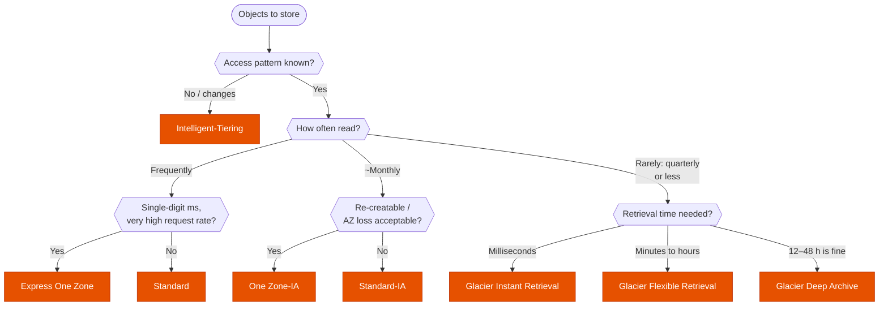

---
tags:
  - "Domain 2: New Solutions"
  - "Domain 3: Continuous Improvement"
  - S3
  - Storage
---

# S3: which storage class and lifecycle?

**The question:** objects have to be stored in S3 at the lowest cost. Which storage class fits the access pattern and retrieval-time requirement, and how do objects move between classes over time?

**Trigger keywords:** *"unknown / changing access patterns"*, *"accessed once a month / quarter / year"*, *"retrieve within milliseconds / minutes / hours"*, *"7–10 years retention for compliance"*, *"re-creatable data"*, *"lowest cost"*, *"lifecycle policy"*, *"tape replacement"*, *"single-digit millisecond latency"*.

## Fundamentals

All classes have **11 nines of durability**. They differ in AZs, retrieval time, minimum duration and fees.

| Class | AZs | First byte | Min duration | Retrieval fee | For |
|---|---|---|---|---|---|
| **Standard** | ≥3 | ms | – | – | Hot data |
| **Intelligent-Tiering** | ≥3 | ms (optional archive tiers: hours) | – | – (small monitoring fee per object) | **Unknown or changing** access |
| **Standard-IA** | ≥3 | ms | 30 days | Per GB | Read ~monthly, must survive an AZ loss |
| **One Zone-IA** | **1** | ms | 30 days | Per GB | Read ~monthly, **re-creatable** (copies, thumbnails) |
| **Glacier Instant Retrieval** | ≥3 | **ms** | 90 days | Per GB (higher) | Read ~quarterly, needs instant access |
| **Glacier Flexible Retrieval** | ≥3 | Expedited 1–5 min · Standard 3–5 h · Bulk 5–12 h (free) | 90 days | Per GB / request | Archives, read 1–2× a year |
| **Glacier Deep Archive** | ≥3 | Standard ≤12 h · Bulk ≤48 h | **180 days** | Per GB / request | Compliance archives, tape replacement |
| **Express One Zone** | **1** | **single-digit ms** | – | – | ML training, analytics, high request rates (directory buckets) |

- **IA and Glacier IR** bill a **minimum of 128 KB** per object: tiny objects cost more there than in Standard.
- **Glacier Flexible and Deep Archive** objects are not readable directly: you **restore** a temporary copy first.
- **Intelligent-Tiering** moves objects to Infrequent Access after 30 days without access, to Archive Instant Access after 90 days, and back to Frequent on access. The **Archive Access** and **Deep Archive Access** tiers are opt-in and need a restore. Objects under 128 KB stay in the Frequent tier.

### Lifecycle rules

- **Transition** actions move objects **down** the waterfall (Standard → IA → Glacier IR → Glacier Flexible → Deep Archive). Never back up: to bring an object back, restore and copy it.
- To Standard-IA / One Zone-IA: objects must be **at least 30 days old**.
- **Expiration** actions delete current versions, noncurrent versions (versioned buckets) and **incomplete multipart uploads**.
- Filters: prefix, tags, object size. By default, objects **under 128 KB are not transitioned**.
- Each transition is a billed request: millions of tiny objects can cost more to move than to keep.
- **Storage Class Analysis** watches access patterns and recommends when to move **Standard → Standard-IA** (only that). **Storage Lens** gives org-wide usage and cost-saving recommendations.

## Decision tree

Then add **lifecycle rules** for data whose access drops with age (e.g. Standard → Standard-IA at 30 days → Glacier Flexible at 90 → Deep Archive at 365 → expire at 7 years).

## Why each branch

- **Unknown pattern → Intelligent-Tiering.** No retrieval fees and no guessing; the monitoring fee is the price. Not worth it for millions of tiny objects or data you already know is cold.
- **Known decay with age → lifecycle rules.** Cheaper than Intelligent-Tiering's monitoring when the pattern is predictable (logs, backups).
- **AZ loss acceptable → One Zone.** ~20% cheaper than Standard-IA, but data is gone if the AZ is destroyed. Only for data you can rebuild or that has another copy (e.g. a CRR destination).
- **Rare but instant → Glacier IR.** Cheaper storage than Standard-IA, higher retrieval fee, 90-day minimum. Medical images, news archives.
- **Minutes is fine → Glacier Flexible**, with **Expedited** retrieval (optionally provisioned capacity to guarantee it). **Hours** → Standard; **cheapest restore** → Bulk.
- **12 h+ is fine → Deep Archive.** Cheapest storage in AWS. The standard answer for *"keep 7–10 years for regulators, almost never read"*.

## Comparison

| | Standard-IA | One Zone-IA | Glacier IR | Glacier Flexible | Deep Archive |
|---|---|---|---|---|---|
| Availability (design) | 99.9% | 99.5% | 99.9% | 99.99% | 99.99% |
| Survives AZ loss | ✅ | ❌ | ✅ | ✅ | ✅ |
| Instant read | ✅ | ✅ | ✅ | ❌ restore | ❌ restore |
| Min duration | 30 d | 30 d | 90 d | 90 d | 180 d |
| Relative storage cost | $$$ | $$ | $$ | $ | ¢ |

## Exam traps

!!! warning "Glacier Flexible for *\"immediate\"* access"
    Even Expedited takes minutes and needs a restore. *"Rarely accessed but must be available in milliseconds"* → **Glacier Instant Retrieval**.

!!! warning "One Zone-IA for the only copy"
    Cheap, but a single AZ. If the data can't be re-created, it's the wrong answer.

!!! warning "Deleting early still costs the minimum"
    An object deleted or transitioned after 10 days in Standard-IA is billed for 30; in Glacier Flexible for 90; in Deep Archive for 180. Short-lived data belongs in Standard.

!!! warning "Small objects in IA / Glacier"
    128 KB minimum billable size in IA and Glacier IR, plus per-object metadata overhead in Glacier Flexible and Deep Archive. Aggregate small files (tar/zip) before archiving.

!!! warning "Lifecycle can't move data up"
    No rule moves Glacier → Standard. Restore the object, then copy it over itself with the new storage class.

!!! warning "Reduced Redundancy Storage"
    Deprecated. Never the answer.

!!! warning "Incomplete multipart uploads"
    They're billed but invisible in the console listing. Add a lifecycle rule **AbortIncompleteMultipartUpload**.

## Test yourself

??? question "1. A data lake's access patterns are unpredictable: some datasets are hot for weeks, then untouched for months. Minimize cost without operational effort."
    **S3 Intelligent-Tiering**, optionally with the Archive Access tiers if apps can tolerate a restore.

??? question "2. Application logs are read often for a week, sometimes for a month, then kept 7 years for audit and practically never read. Retrieval within 48 h is acceptable."
    Lifecycle: **Standard → Standard-IA at 30 days → Glacier Deep Archive** (e.g. at 90 days) → **expire at 7 years**.

??? question "3. A hospital stores X-rays read a few times a year, but when needed a doctor must see them immediately."
    **Glacier Instant Retrieval**.

??? question "4. Thumbnails are generated from originals kept in Standard and are read about once a month. Cheapest class?"
    **One Zone-IA**: they can be regenerated if the AZ is lost.

??? question "5. A bucket's bill keeps growing although listed objects haven't changed. Many uploads fail midway."
    **Incomplete multipart uploads**. Add a lifecycle rule to **abort incomplete multipart uploads** after N days.

??? question "6. Archived data in Glacier Flexible Retrieval must occasionally be retrieved within 5 minutes, guaranteed, even at peak."
    **Expedited retrieval** with **provisioned retrieval capacity**.

## Related

- [EFS: performance mode, throughput mode and storage class](efs-performance-storage.md)
- [Backup: DLM vs AWS Backup vs native](backup-strategy.md)
- AWS docs: [S3 storage classes](https://docs.aws.amazon.com/AmazonS3/latest/userguide/storage-class-intro.html)
- AWS docs: [Transitioning objects using lifecycle](https://docs.aws.amazon.com/AmazonS3/latest/userguide/lifecycle-transition-general-considerations.html)
