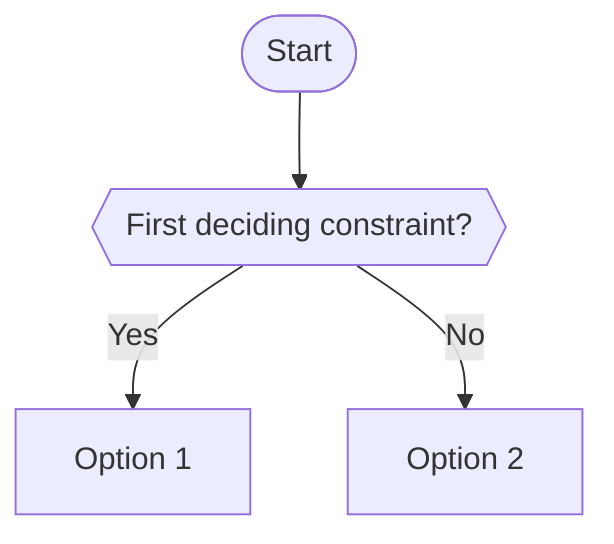

---
tags:
  - "Domain N: …"
  - <Service or topic>
---

# <The decision, phrased as a question>

**The question:** one or two sentences describing the choice.

**Trigger keywords:** *"…"*, *"…"*: phrases in a question stem that should bring you here.

## Fundamentals

Just enough about each option to follow the tree. A table works well.

## Decision tree

## Why each branch

- **Branch:** the reasoning behind it, not just the rule.

## Comparison

| | Option 1 | Option 2 |
|---|---|---|
| Criterion | | |

## Exam traps

!!! warning "Short name of the trap"
    Why the distractor looks right and why it's wrong.

## Test yourself

??? question "1. Short scenario ending with a question?"
    **Answer.** Why, referring to the tree.

## Related

- [Other decision](../other/page.md)
- AWS docs: [Page](https://docs.aws.amazon.com/)
